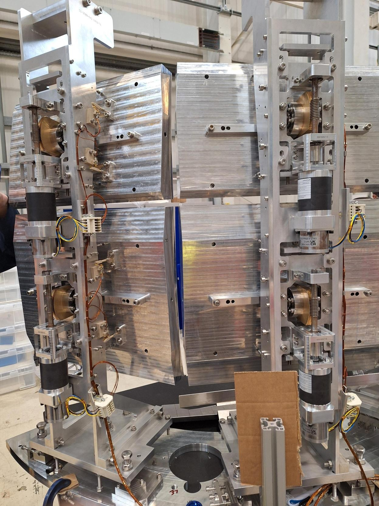

# OSIRIS Analyser Towers

OSIRIS has a set of analyser towers with an unusual motion control setup. The purpose of the analyser towers
is to focus beam from the sample onto a detector. The towers are motion-controlled to allow this focus to
be adjusted.

There are 4 analyser towers in total; these are labelled Towers 4, 3, 2, 1 looking left-to-right from the sample
position. Each tower has two plates, an upper and a lower plate, which can drive independently.

## Setup notes

- This setup is unusual in that only two galil axes are used at a time (always an upper/lower pair for one tower).
To control other towers, the corresponding motors will be physically unplugged and a new tower plugged in to the
Galil controller.
  - **After plugging in a new tower, the motors must be homed before the positions are meaningful**
- All axes are open loop - there are physically no encoders present.
- The motion is not fully reliable. During commissioning, drift (loss of motor steps) was observed on various motors.
As there are no encoders present, the only remedy for this is to rehome regularly.
- Homing is set up to **physically** home in the positive direction, to the upper limit switch.
  - This represents maximum upwards tilt of the analysers
  - However, because the limit switches were wired the wrong way, this actually uses the `Home_RevLimit.gmc` homing routine, and `DIR` is swapped at the motor record level to "Reverse".

For Galil settings used during commissioning, see [here](https://github.com/ISISComputingGroup/ControlsWork/issues/829#issuecomment-3836073060).

## Commissioning positions

Commissioning was done against a set of "reference" positions, checked using a surveying setup (by Accelerator
engineering group). The reference positions represent the positions "as designed" to focus beam onto the detector.
Limit switch positions are set to give approx +/- 1 degree of motion from the reference/design position.

| Tower    | Upper limit switch | Reference position | Lower limit switch |
|----------|--------------------|--------------------|--------------------|
| T4 Lower | 0                  | -0.90              | -2.38              |
| T4 Upper | 0                  | -1.00              | -2.60              |
| T3 Lower | 0                  | -1.02              | -2.07              |
| T3 Upper | 0                  | -0.97              | -2.10              |
| T2 Lower | 0                  | -1.04              | -1.96              |
| T2 Upper | 0                  | -0.87              | -2.14              |
| T1 Lower | 0                  | -1.20              | -2.25              |
| T1 Upper | 0                  | -1.10              | -1.99              |

This photo shows the motion setup from the back (T1 and T2 shown):

