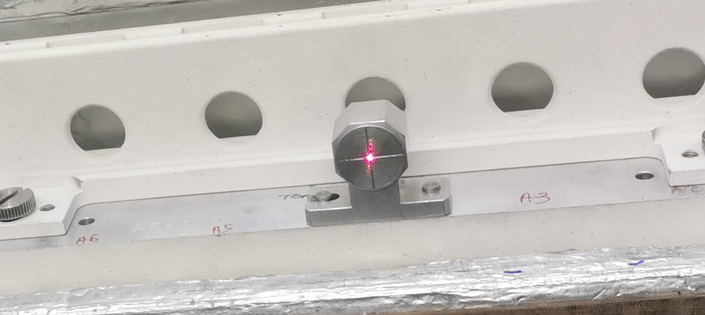

# SANS Sample Changer

The sample changer support module (also referred to as the SANS sample changer) allows a sample changer to be configured on top of [motion set-points](Motion-Set-points). The functionality this adds is to allow a motion set-point list to be created from the definitions of racks and slots.

This takes input files `rackDefinitions.xml` and `samplechanger.xml` and then allows the user to dynamically build the motion setpoints configuration file. As of [October 2020](https://github.com/ISISComputingGroup/IBEX/issues/5720), the user can also select a specific rack, and this will rebuild the list of motion setpoints to only include the positions listed in that rack. If the selected sample changer is the special value `_ALL`, positions from all sample changers will be included in the built motionsetpoints file. This option is automatically added to the list of available sample changers.

An example sampleChanger + motionSetpoints configuration can be found in [sampleChanger support](https://github.com/ISISComputingGroup/EPICS-sampleChanger/tree/master/settings/sans_sample_changer). As a minimum, you will need to define the following environment variables:
- `RACKDEFS`: Path to a rack definitions XML file.
- `SLOT_DETAILS_FILE`: Path to a slot details XML file.
- `SAMPLE_LKUP_FILE`: Path to the sample.txt file that should be written by this module

## Background

There are two different models of two-tier sample changer at ISIS. Both models are very similar; from the point of view of the control system they are effectively the same. The earlier of the two models is used on SANS2D [pictured ​here](http://www.isis.stfc.ac.uk/sample-environment/soft-condensed-matter/sample-changers-and-cell-racks/kit/two-tiered-sample-changer/two-tiered-sample-changer14341.html). The newer model is used on LARMOR.

Each tier on the sample changer can hold two racks side-by-side. Different types of rack are used to hold different types of sample cartridge. The number of cartridges per rack depends on the size of the cartridge - the larger the cartridge, the fewer cartridges will fit in a rack. At present there are 3 types of rack (holding different styles of sample cartridge).

1. Rectangular – 10 position
1. Double stopper – 7 position
1. Banjo style (with 1, 2 or 5mm gaps) – 7 position 

Racks can be mixed and matched as required. For example, the sample changer could be configured with (say): a 10-position, rectangular rack and a 7-position, Banjo style rack on the top tier and two 7-position, Double stopper racks on the bottom tier, which would allow an experiment to use 31 samples. A picture of the [LARMOR sample changer](http://www.facilities.rl.ac.uk/isis/computing/ICPdiscussions/Larmor/LAMOR%20RACK%20VIEW.jpg) shows an alternative configuration.

With the current types of rack, the two tier sample changer can hold a maximum of 40 samples (4 x 10-position rectangular racks; 2 on each tier).  Diagrams of various types of Banjo-style cartridges are available: [Banjo 1mm gap)](http://www.facilities.rl.ac.uk/isis/computing/ICPdiscussions/Larmor/BANJO-CELL-RACK.pdf), [Banjo 2mm gap)](http://www.facilities.rl.ac.uk/isis/computing/ICPdiscussions/Larmor/BANJO-CELL-RACK-2MM.pdf), [Banjo 5mm gap)](http://www.facilities.rl.ac.uk/isis/computing/ICPdiscussions/Larmor/BANJO-CELL-RACK-5MM.pdf).

The positions of the samples in each rack are known. Motors are used to drive the tiers, so that each sample can be positioned in the beam.

The Sample Changer IOC needs to allow a scientist to select any sample loaded into the sample changer. The maximum number of positions is 40 (based on current rack designs, but this could change in the future). Each position comprises a name and an (x, y) coordinate pair. The scientist will select positions by their names.

## What to do after changing racks

1. Edit Instrument/Settings/machinename/configurations/motionSetPoints/sampleChanger.xml setting the `rack_type`, `xoff` and `yoff` attributes.
1. Either press the "Reload config" button on the sample changer OPI, which can be accessed from the synoptic view or put a value to machinename:username:SAMPCHNG:RECALC

## Mapping motors to axes

The sample change works in terms of motors with names beginning MOT:STACK:. 
These are axes which are mapped by the file Instrument/Settings/machinename/configurations/galil/axes.cmd

## Mapping named positions to motor positions

This is done using motionSetPoints.
The file Instrument/Settings/machinename/configurations/galil/motionsetpoints.cmd includes lines which 
create PVs starting LKUP:SAMPLE that perform the conversion from name to position, using the 
lookup file Instrument/Settings/machinename/configurations/motionSetPoints/samples.txt.

The first coordinate is the position of machinename:username:MOT:STACK:Y 
and the second coordinate is machinename:username:MOT:STACK:ZLO.

Generating samples.txt by hand is tedious so the sampleChanger IOC exists to automate the process

## Defining the Sample Positions

The positions are calculated from two xml files, rack_definitions.xml, which should change rarely if ever
and samplechanger.xml which should be edited to define what is currently loaded.
Both are located in Instrument/Settings/machinename/configurations/motionSetPoints

## rack_definitions.xml

This contains two sections, racks and slots.

Racks contain a series of rack element which definite the various rack types. 
Each rack has a name and contains multiple position elements which have a name and an x and a y coordinate.

```

	<?xml version="1.0"?>
	<definitions>
		<racks>
			<rack name="Rectangular">
				<position name="1" y="0" x="10"/>
				<position name="2" y="0" x="20"/>
				<position name="3" y="0" x="30"/>
				...
```

Slots define the slots into which racks can be fitted.
Each slot has a name and an x and a y coordinate.

```

	<slots>
		<slot name="Top_Left" x="0" y="15"/>
		<slot name="Top_Right" x="300" y="15"/>
		<slot name="Bottom_Left" x="0" y="0"/>
		<slot name="Bottom_Right" x="290" y="17"/>
	</slots>
```

## samplechanger.xml

This defines what racks are currently loaded.

```

	<?xml version="1.0"?>
	<slots>
		<slot name="Top_Left" sample_suffix="TL" rack_type="Banjo 1mm" xoff="0.0" yoff="0.0"/>
		<slot name="Top_Right" rack_type="Rectangular" xoff="0.0" yoff="0.0"/>
		<slot name="Bottom_Left" rack_type="Double Stopper" xoff="0.0" yoff="0.0"/>
		<slot name="Bottom_Right" rack_type="Banjo 5mm" xoff="0.0" yoff="0.0"/>
	</slots>
```
	
Each slot element has the following attributes:

* name, which must match the name of one of the slot elements in rack_definitions.xml
* rack_type, which must match the name of one of the rack elements in rack_definitions.xml
* `xoff` and `yoff` which are the offsets between the nominal position of the slot defined in rack_definitions.xml and its actual position
* `sample_suffix`, optional attribute. By default the name of each sample position in the rack will be the name of the position as defined in the `rack` followed by the name of the slot e.g. `1Top_Left`. By specifying the `sample_suffix` you can change what is appended to the sample names e.g. the above would create a sample called `1TL`.

## Generating sample.txt

The sampleChanger module will be loaded by Instrument/Settings/machinename/configurations/galil/sampleChanger.cmd.
It creates the PV machinename:username:SAMPCHNG:RECALC. 
Putting to that PV will cause the module to read rack_definitions.xml and samplechanger.xml 
and use them to generate a new sample.txt. 
It will then prompt the relevant motionSetPoint instance to load the name sample.txt.

Recalculation can also be initiated from the GUI by pressing the "Reload config" on the sample changer OPI,
which can be accessed from the synoptic view.

The motor positions for a sample position are calculated by summing the positions for the slot, the position in the rack
and the offset. This if the slot has x=1, the position has x=2 and the slot has xoff=3 then the x position will be 6.
The x position corresponds to machinename:username:MOT:STACK:Y 
and the y position corresponds to machinename:username:MOT:STACK:ZLO.

Position names are created by concatenating the position name and the slot name (or `sample_suffix`, see above).

## Images

### Banjo rack


### Banjo Sample


### Skinny Rack


### Skinny Sample


### Wide Rack


### Beam position Calibration 


### Sample Changer X Axis movement


### Sample Changer X and Y Axis Movement

