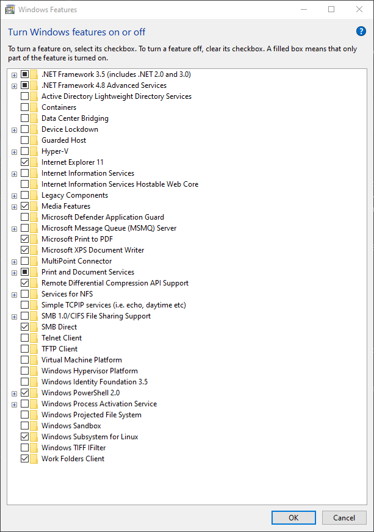
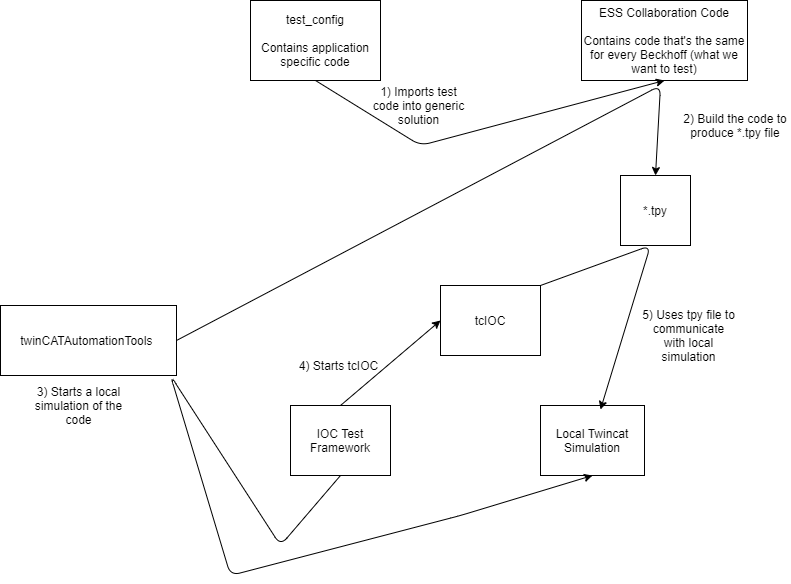

# Beckhoff testing

## Building, simulating and testing the code

```{note}
The Beckhoff XAR runtime environment [does not support windows 11](https://infosys.beckhoff.com/english.php?content=../content/1033/tc3_overview/6162419083.html&id=). This means that if you are on a Windows 11 development PC, you cannot run the Beckhoff tests.

Beckhoff XAE (the editor) is supported on Windows 11.
```

<details>
<summary>You may need to disable some windows features, such as Hyper-V, Windows Hypervisor Platform etc.
For reference, here is a working setup and its features (click to expand) </summary>



To revert this run: `Enable-WindowsOptionalFeature -Online -FeatureName Microsoft-Hyper-V -All` in an elevated Powershell window.
</details>

Beckhoff code can be run as a simulated system on a developer machine by doing the following: 

 1. Clone `BeckhoffTestRunner` using `git clone --recurse-submodules https://github.com/ISISComputingGroup/BeckhoffTestRunner.git C:\Instrument\Dev\BeckhoffTestRunner\` 
 1. Run `settick.bat` with admin privileges (this requires a reboot, but do it after the next step)
 1. Download and install **VERSION 4024.11**(and no later!) of TwinCAT 3 XAE from `<public_share>\installers`. The XAE is really just a DLL and a Visual Studio plugin. **Reboot after installing.** ~[TwinCAT 3 XAE](https://stfc365.sharepoint.com/sites/ISISMechatronics/Shared%20Documents/Forms/AllItems.aspx?viewid=a9a65e76%2D4335%2D479e%2Da1eb%2De12265e5cad6&id=%2Fsites%2FISISMechatronics%2FShared%20Documents%2FTwinCAT%20Development%2FTwinCAT%20Software) If you do not have permission ask IDD~.
 1. Run `build.bat` to build the `twinCATAutomationTools` binaries, which then sets up a working simulated PLC.
 1. To run a PLC locally you need a license. Open TwinCAT XAE shell, select "open solution" and open `C:\Instrument\Dev\BeckhoffTestRunner\PLC_solution\solution.sln` Navigate in the solution explorer to `solution -> SYSTEM -> License` - open this and select "7 days trial license". You may now close the XAE Shell.
1. run `run_tests.bat` in the `BeckhoffTestRunner` directory to begin testing. You should notice that your system tray icon turns green which means you are running a simulated PLC and testing against it. 

_NB the IOC tests do not stop the PLC at the end of the run, however this isn't a problem as the PLC is restarted when the IOC tests start._

_When you have finished testing/reviewing a PR, it is best to run `unsettick.bat` as admin and reboot - otherwise you will have loads of "time discontinuity detected" messages in IOC logs_

## Other information on testing and configuring a Beckhoff
### Using XAE shell to manually build a PLC
<details><summary> manual steps </summary>


1. Ensure that you have the following toolbars enabled in the XAE shell (`Tools > Customize...`):
    - `TwinCAT PLC`
    - `TwinCAT XAE Base`
1. Click the `Activate Configuration` button  

2. TwinCAT will ask you to enter a code to get a trial license. You will need to do this once a week.
3. If prompted if you wish to start the system in `Run Mode` click `Ok`. Otherwise start run mode using the button next to `Activate Configuration` 
4. You now have a simulated Beckhoff PLC running on your PC. This behaves the same as real hardware and so all development can be done against it. You could now also run an IOC up talking to this local PLC.
5. To see what is happening inside this PLC in more detail, and to change values, you can use the login button 

</details>

### Continuous Integration

<details><summary>Jenkins</summary>


Beckhoff PLC code is being developed by people who do not have CI expertise and have their own repository structures yet we want integration into some form of CI to be as easy as possible. This lent itself to the following structure:
* A `BeckhoffTestRunner` repository that is owned by us and contains the jenkinsfile and other utilities required for CI
* Every branch on this repository (apart from master) then pulls a different PLC project down (note each project could be from a different repository or from separate branches on the same repository)
* The jenkinsfile can then do the one or both of the following:
   * Build the project (currently assumed to be called `solution.sln` at the top of pulled PLC project)
   * Run any [IOCTestFramework](https://github.com/ISISComputingGroup/EPICS-IOC_Test_Framework) tests (currently assumed to be in a `tests` folder at the top of the pulled PLC project) - these will likely be written by us

This means that the workflow for adding new PLC projects into CI is:
1. A PLC developer writes their code (making sure the solution is called `solution.sln`)
2. They give us a link to the repo and branch that contains the code
3. We create a new branch on `BeckhoffTestRunner` and modify it to point at their repo
4. At this point they have CI for building their code
5. We make a decision about whether the code requires any system tests and if so add some into their repository

To actually run tests we use the Beckhoff `automation interface` which can do any of the things you can do in the TwinCAT XAE automatically through DCOM. AC# (Beckhoff do not fully support a Python interface 😢) program (`twinCATAutomationTools`) has been written to leverage this interface in the following way to write integration tests for the Beckhoff:



1. Jenkins will pull a branch of [BeckhoffTestRunner](https://github.com/ISISComputingGroup/BeckhoffTestRunner).
2. `build.bat` is run to do the following:
   1. Build the `TwincatAutomationTools` solution, [twinCATAutomationTools](https://github.com/Simon-Cooper/twinCATAutomationTools)
   1. Use the `twinCATAutomationTools` to import the `test_config` into the generic TwinCAT Solution and build the PLC code using the `automation interface`. This build will also create a `*.tpy` file, which outlines how to connect to the PLC and can be used to configure the IOC itself.
3. The IOC test framework is started. This will use the `TwinCATAutomationTools` program to run a local simulated PLC. Then startup and test the Beckhoff TwinCAT in the usual way.

This is currently being run on the ndw1926 node on Jenkins. A quirk of using this DCOM interface is that the Jenkins slave must be run as an interactive user and thus not as a service. To do this there is a bat file that should run on startup inside `C:\Users\ibexbuilder\AppData\Roaming\Microsoft\Windows\Start Menu\Programs\Startup`.

The current Beckhoff applications that are being run through `tcIOC` and the CI pipeline discussed above are:
* [dummy_PLC](https://github.com/ISISComputingGroup/BeckhoffPLCCode/tree/dummy_PLC)- a PLC that does very little, basically used to test that fundamental tcIOC comms works
* [old_ISIS_code](https://github.com/ISISComputingGroup/BeckhoffPLCCode/) - this is the old ISIS prototype motion code that is currently on the CRISP jaws. Hopefully this code can be removed once the jaws are moved on.
* [ESS_base_code](https://bitbucket.org/europeanspallationsource/tc_generic_structure/) (now linked to by `main` of the `BeckhoffTestRunner` repository) - this is the collaboration code that we will be using go forward.

<details>
<summary> MCAG (defunct) - click to expand </summary>

This IOC was originally written by ESS. It uses an ASCII protocol over TCP/IP to do the communication and is very specifically designed for motion. There is a simulator which can be run using the following steps:

- `cd EPICS\support\MCAG_Base_Project\master\epics\simulator`
- `doit.bat`
- Start the IOC (host macros needs to be set to 127.0.0.1:5024)

~Currently this is only being run on IMAT. It should soon be replaced by the collaboration code.~ - **It has been replaced by the new code, so is now defunct.**
</details>

</details>


#### `currentTime::getCurrentTime(): time discontinuity detected`
This is a weird error that seems to occur sometimes when running a Beckhoff simulator on a dev machine. To stop it you need to do run `unsettick.bat` script in `tcioc\master` and reboot. NB this should never happen on an instrument machine as they do not run simulated Beckhoffs. 
