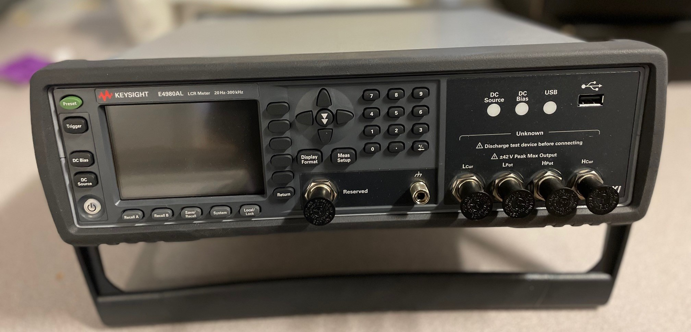
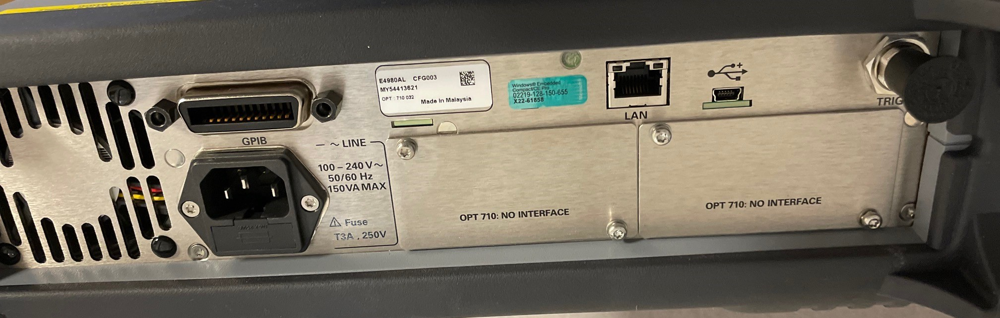

# Keysight (previously Agilent) E4980AL LCR Meter

The Keysight E4980AL is an LCR (inductance, capacitance and resistance) meter used on WISH. 
It uses USB, GPIB or ethernet(TCP IP) for communication and follows the SCPI protocol. 

this device can perform several functions, all of these give back two readings/measurements. these are shown on the front panel. 

