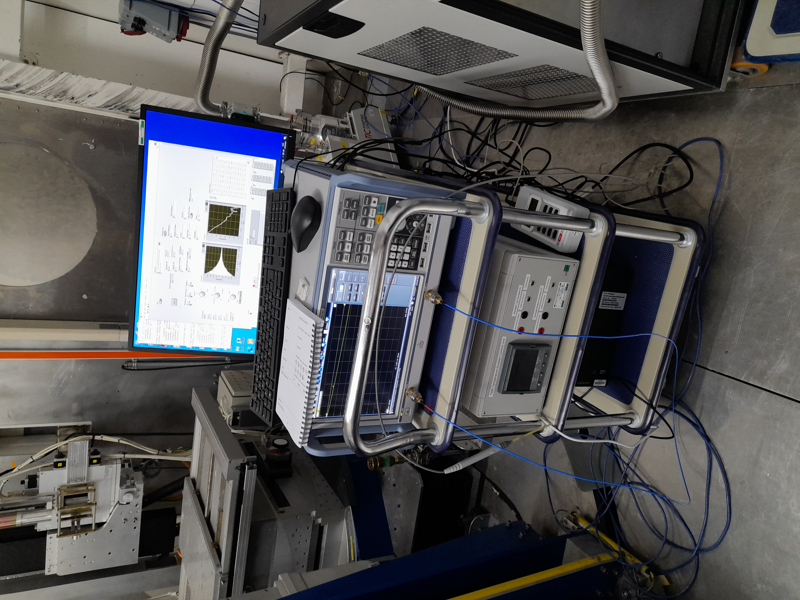

# Ferro-Magnetic Resonance equipment (FMR)

## Description of purpose of experiment (Abstract of talk given by principal investigator on 01/07/2020)

> Ferromagnetic Resonance Spectroscopy

> Modern day fast computation necessitates high density data storage systems. This could be achieved through the development of multilayer thin films, consisting of alternating hard and soft magnetic layers, which exhibit magnetic moment exchange coupling at the interfaces. However, Ferromagnetic Resonance (FMR) measures the bulk magnetisation dynamics of a sample and hence cannot probe these interlayer interactions. Therefore, this project aims to explore the capabilities of FMR as a magnetic characterisation technique through the development of three novel sample environments. Firstly, FMR combined with Polarised Neutron Reflectometry, using the beamline POLREF, can map a sample’s magnetisation dynamics at each atomic layer, therefore improving the resolution of magnetic detection. Also, the novel sample environments of variable temperature FMR and temperature gradient FMR offer the potential of investigating the effect of temperature on magnetic moment switching and spin wave formation.

## Equipment

This is a small collection of devices which internal ISIS users are testing offline, but have used on the POLREF beamline.  They have written a control program in LabVIEW which runs on a separate machine and communicates with these devices.  It handles the setpoints, scan/sweep procedure, analysis and data file generation.

The individual pieces of equipment are:

- Rohde & Schwartz (ZNB20?) Vector Network Analyser
- Hirst (GM08?) portable Hall probe
- Danfysik 858 PSU (when used on POLREF, Danfysik 8000(?) when offline) connected to...
- ...GMW conventional electromagnet (not cryogenic, no direct control required)

The current solution for using the FMR setup on the beamline is that the users' VI is "wrapped" by an LVDCOM IOC to isolate the code and provide remote communication from the POLREF control machine.  Modifications had to be made to this VI to enable it to be run continuously and make the front panel item names compatible with LVDCOM (remove trailing spaces and scientific notation values e.g. `Start Frequency (300.0e3) `).  The equipment PC runs a "Mini-Inst" to enable this LVDCOM IOC to function.

A bespoke CALAB-based VI was written and runs on the POLREF control machine.  This enables communication with the FMR equipment IOC via CA and provides scripting and logging capabilities in the SECI system.

### Description of principal controls/setpoints and indicators/readbacks with associated PVs

PV naming scheme separates the three devices comprising the FMR system (:PSU:, :PROBE:, :VNA:).  Also the VI itself (:FMR:)

#### Power Supply Unit (:PSU:)

| VI Control | VI Indicator | Read PV address | Write PV Address | Units | Description |
|---|---|---|---|---|---|
| "Start Ba  (A)" | | BA:START | BA:START:SP | A | Applied magnetic field (Bapplied) at start of sweep, as a current |
| "Stop Ba  (A)"  | | BA:STOP  | BA:STOP:SP  | A | Applied magnetic field (Bapplied) at end of sweep, as a current |
| "Number of Ba Points" | | BA:POINTS | BA:POINTS:SP | N/A | Number of points in sweep |
| "Millisecond timer" | | TIMER | TIMER:SP | ms | | Delay between setting PSU and reading probe |
| | "Actual Current Level (A) " | CURR | | A | PSU output current | 
| | "Current Difference" | CURR:DIFF | | A | Difference between set current and actual |
| | "Delay (ms)" | DELAY | | ms | Delay between setting and reading current |
| | "Loop Number" | LOOP | | N/A | Sweep step number |

#### Hall Probe (:PROBE:)

| VI Control | VI Indicator | Read PV address | Write PV Address | Units | Description |
|---|---|---|---|---|---|
| | "Current value " | VALUE | | variable | Field reading |
| | "Range 4" | RANGE | | N/A | Current range |
| | "Mode 4" | MODE | | N/A | Probe mode |
| | "Units 5" | UNITS | | N/A | Current units |

#### Vector Network Analyser (:VNA:)

| VI Control | VI Indicator | Read PV address | Write PV Address | Units | Description |
|---|---|---|---|---|---|
| "RF State (T) 2" | | STATE | STATE:SP | N/A | RF on or off |
| "Start Frequency" | | FREQ:START | FREQ:START:SP | Hz | Frequency at start of sweep |
| "Stop Frequency" | | FREQ:STOP | FREQ:STOP:SP | Hz | Frequency at end of sweep |
| "Number Of Points" | | FREQ:POINTS | FREQ:POINTS:SP | N/A | Number of steps in frequency sweep per field value |
| "In Port" | | PORT:IN | PORT:IN:SP | N/A | Input port number |
| "Out Port" | | PORT:OUT | PORT:OUT:SP | N/A | Output port number |
| "Sweep Time" | | SWEEP:TIME | SWEEP:TIME:SP | s | Duration of sweep |
| "Auto Sweep Time" | | SWEEP:TIME:AUTO | SWEEP:TIME:AUTO:SP | N/A | Automatic sweep time |
| "Milliseconds to wait" | | WAIT | WAIT:SP | ms | Delay between setting frequency and analysing response |
| "Bandwidth" | | BANDWIDTH | BANDWIDTH:SP | Hz | Analyser resolution bandwidth |
| "Power" | | POWER | POWER:SP | `dBm` | Analyser signal power |

#### Main VI (:FMR:)

| VI Control | VI Indicator | Read PV address | Write PV Address | Units | Description |
|---|---|---|---|---|---|
| "Run" | | RUN | RUN:SP | N/A | Run analysis |
| | "Activity" | ACTIVITY | | N/A | Indicates VI running if value oscillates between ON and OFF |

### Future Development

Currently, the users' FMR VI does not conform to ISIS standards and would need a reasonable amount of work to do so.  Rather than concentrate efforts on this VI, and as POLREF has now been migrated to IBEX, it may be decided to rewrite the FMR control program as a native IOC, or collection of IOCs (c.f. [zero field](https://github.com/ISISComputingGroup/ibex_developers_manual/wiki/Zero-field-controller)) and possibly run a "[remote IOC](https://github.com/ISISComputingGroup/ibex_developers_manual/wiki/Remote-IOCs)" (c.f. Triton) installation.  At the very least an OPI will be needed to communicate with the LVDCOM VI.  The direction of development will depend on the results of the online tests (and anticipated further offline), how much effort is/will be available from the IBEX team and how much the equipment will be subsequently used.
