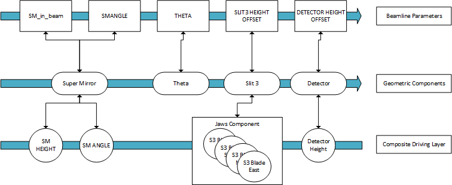

# Beamline object

The Beamline object is assembled in a python configuration file that lives in `<INST>/configurations/refl/config.py`. 

This is the coordinating object for the system, it performs the correct movements based on the beamline parameters and mode which is currently active. The mode dictates which parameters are active in the calculation and preset values for any parameters. There are a number of modes which need to be supported in the system; for example NR mode, polarised, disabled etc. There is also a natural ordering of beamline parameters and components when it comes to calculations due to the direction of the beam, i.e. parameters for components closer to the source should be calculated before those further away as the latter have to be calculated relative to the changed beam path. For example the polarising mirror and all calculation to do with it should be done before the sample point calculations. The architecture is that a beamline object holds the order of both the components and beamline parameters. The composite drivers do not have a natural order but these are also contained by the beamline object. It makes sure that all calculations are done in the order in which they are held. 

The `Beamline` object takes the following arguments:

#### Required:
- `components`: A list of all `Component`s, ordered from beam start to beam stop
- `beamline_parameters`: A list of all `BeamlineParameter`s, ordered from beam start to beam stop
- `drivers`: A list of all `IocDriver`s, ordered from beam start to beam stop
- `modes`: A list of all `BeamlineMode`s

#### Optional:
- `incoming_beam`: The beam start node as a `PositionAndAngle`, i.e. the beam as it enters the blockhouse (Default: `PositionAndAngle(0,0,0)`)
- `footprint_setup`: The footprint setup to use (Default: `None`)
- `beamline_constants`: The list of `BeamlineConstants` (Default: `None`)

The following is a subsection of the configuration showing beamline parameters at the top, components in the middle and drivers at the bottom.

 

#### Whole Beamline Move

When move for the whole beamline is triggered, the new positions of the motors are calculated using the following procedure. 

1. Each of the sample parameters is considered in turn, going down the beam. 
1. The beamline parameter is "moved to" if any of the following is true:
    - the setpoint has been changed by the user
    - an init value for the current mode has been defined in the config and "apply inits on move" is enabled
    - it is in the current mode and a previous beamline parameter also in this mode has changed
1. When the beamline parameter is "moved to" the result of the calculation will be passed down to the component it controls.
    1. At this point the set point readback value will read the same as the set point
    1. The component will then recalculate the beam path and instruct those components down beamline to recalculate their beam paths.
1. Once all beamline parameters have finished calculating along with new component positions, the composite driving layer calculates the time taken for the slowest movement and performs the move in that time for all components.

#### Single Beamline Parameter Move

When a single beamline parameter is set and moved on its own then:

If the beamline parameter is in the current mode:

1. Each beamline parameter in the mode is considered in turn, going down the beam starting from the beamline parameter which just moved.
2. If the parameter is in the mode the beamline parameter moves to its last set point (i.e. the one in the set point readback). This will pass down the calculation to the component it controls.
3. As above, the drivers then tell the motors to move.

If it is not in the mode:

1. That beamline parameter sends its setpoint to the component it controls.
2. Then the beamline is recalculated
3. Motors are then moved

#### Changing the Mode

When the mode is changed to (not disable mode) the following happens:
1. In beamline parameter order each pre-set is applied to the setpoint (but not moved to).
    1. This includes setting whether the components are in the beam or not
2. The parameters in the beamline are activated/deactivated as defined by the newly set mode.

#### Disabled Mode

A mode can be declared as ”disabled mode” via parameter in its constructor. Disabled mode is special because in this mode the movements are relative to the positions when the mode was entered into. This is done by disabling the beam calculation for each component. The idea of disabled mode is to unlink all components from each other and stop tracking the beam path. Only theta related parameters should be in this mode, since theta is an angle between two components and by definition will not make sense if those are unlinked.

#### Beamline Constants

The beamline may also define constants: these are values set in the configuration file that the user wants exposed via a PV for the instrument, for example the Z coordinates of components, or the maximum Theta angle for this instrument. These can then be used in scripts like `run_angle`, for example to derive the distance between slits for footprint calculation. The value for the constant must be either a number or a boolean. They are set by passing them into the beamline object as an optional parameter. 

**For more information on implementation specifics see the [Reflectometry Configuration page](https://github.com/ISISComputingGroup/ibex_developers_manual/wiki/Reflectometry-Configuration#beamline-constants)**