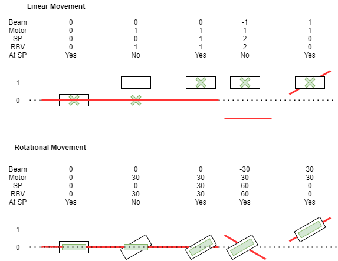
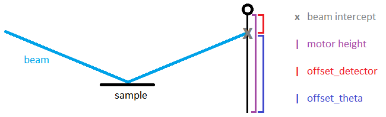

# Beamline Parameters

Beamline parameters represent high-level values a user may wish to set. They can have blocks or the GUI controls pointed at them. These parameters are transformations of low-level motor values. The reflectometry server creates the following PVs for each parameter (where `<BASE>` is `<PREFIX>:REFL:PARAM:<NAME>`):

- `<BASE>` - Readback: the value as calculated from the low-level motor positions.
- `<BASE>:SP` - Setpoint: when set, the reflectometry server will move the parameter this value
- `<BASE>:SP:RBV` - Setpoint read-back: the last value that this parameter was moved to.
- `<BASE>:SP_NO_ACTION` - if this is set the setpoint is stored but not applied to the motor until the next time a move is triggered on this parameter.
- `<BASE>:ACTION` - moves this parameter to the setpoint
- `<BASE>:RBV:AT_SP` - True if readback value is within tolerance of the setpoint
- `<BASE>:CHANGED` - True if this setpoint has changed since the last time this parameter was moved
- `<BASE>:IN_MODE` - True if the parameter is in the currently active beamline mode
- `<BASE>:CHANGING` - True if the parameter readback value is currently changing (i.e. an underlying motor is moving)
- `<BASE>:DEFINE_POSITION_AS` - redefines the current parameter readback to the given value (does not move the motor)

**For more information on implementation specifics see the [Reflectometry Configuration page](#reflectometry_beamline_parameters)**

## Example of Beam Offset Axis

Some axes are direct in that they set the position from a beam that can not move, e.g. TRANS. In this case the motor value and parameter values are the same since the beam is at zero. In the case of parameters in the plane where the beam can move this can be more complicated to think about here is a diagram of the set point and read back for cases where the beam in moving around (beam is red, component is white and set point is green):

First line of positions is linear axis and second line in rotational.

## Theta Readback Calculation

The theta beam line parameter is special because it depends on other items in the beamline. All other components are independent except for the incoming beam from a previous component. 

**Theta readback is**: Half the sum of the incoming angle and outgoing angle at the point where the incoming beam hits the theta movement axis, this point is called the virtual sample point; the point at which you should mount the same to make the reflection. The theta movement axis should usually be identical to the sample movement axis. The incoming beam is calculated from the component before the theta component. The outgoing angle is calculated by using a list of components set on the theta component in the configuration. It find the first component in that list which is in the beam, from this component it calculates theta.: 

1. Component is on a linear slide: Theta is angle to component. The height of the component is its actual position without any setpoint offset. Theta is the angle of the line from the virtual sample point to the component. NB It does not matter what angle this component is pointing in when calculating theta.
2. Component is on a bench: Theta is the angle of the bench; The bench pivots around the virtual sample point. NB It does not matter what height the bench is at when calculating theta.

For example, on CRISP it is the angle to the first detector which is in the beam. If both detectors are in the beam the point detector is used. The offset to that detector is then taken away from the current position and this is the angle used to calculate theta. From a coding point of view, this means when the readback or setpoint position of a component in this list is updated then the readback is updated.

## Theta Setpoint Calculation

The setpoint for theta is special because all it does is change the beam path it does not affect any underlying PVs. However in disabled mode, the incoming beam is no longer altered and this means changing theta would have no effect on the component it is pointing at, e.g. changing Theta would not alter the position of the detector. To fix this there is a special route to force an incoming beam path to be set. This should allow the component defining theta to move when theta is changed.

{#reflectometry_parameter_init}
## Parameter Initialisation

When starting the IOC, the beamline parameter values are initialized. The intended behaviour is that if you restart the reflectometry IOC, it should come back exactly in the state you left it in.

- Readback values are set to their real current values based on the physical motor positions, i.e. they behave the same as they do at any given moment in time the reflectometry IOC is up.
- Setpoints are initialized in one of two ways, based on what the parameters have their `autosave` attribute set to.
   - If `autosave=False`, it will initialise the setpoint based on motor value, i.e. it will be the same as the readback value. This is the default behaviour.
   - If `autosave=True`, the setpoints will be initialized to a value read from a file in the `Instrument\Var` area. If this affects the beam path (e.g. the autosaved value is the supermirror angle), parameters of components further along the beam path will be computed to be correct given the real motor position and the altered beam path. A parameter's autosave value is updated in the file every time that parameter is moved.

In some cases, autosaved parameters are necessary. 

**Example1**:

Theta is defined by the angle between the sample point and the next component it is angled to (e.g. the point detector). However, the detector itself can also have an offset parameter that moves it to a given position relative to the beam. On intialisation we only have one value for the height of the detector, however we cannot tell which portion of that height comes from theta and which portion comes from the detector offset parameter without saving one of the two values.

**Example2**:

A parameter that can be calculated using an axis that can be parked. In this case if the axis has no auto save and is in its parked position when the IOC is started then it is impossible to tell where the user wants it to be when it is in the beam. In this case the server will issue the error `Parameter <parameter name> is parkable so should have an autosave value but doesn't. Has been set to 0 check its value`, the server will then use zero for the in beam position but you will want to check that it makes sense for this parameter.
