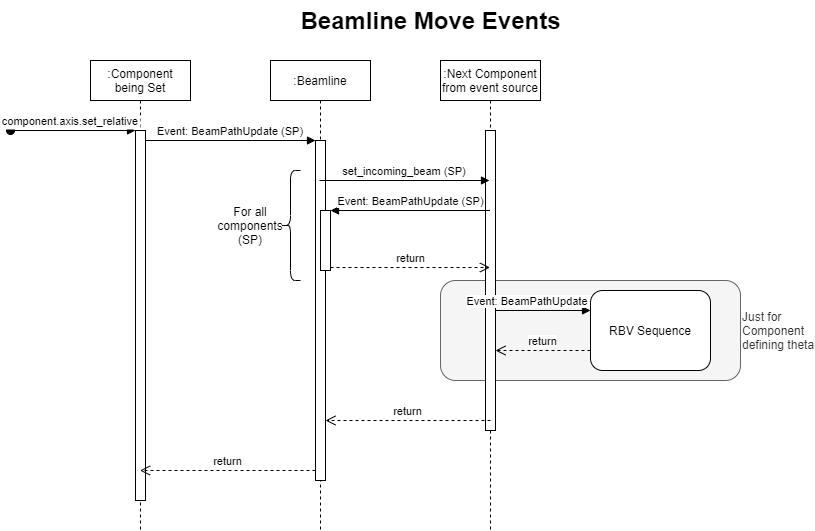
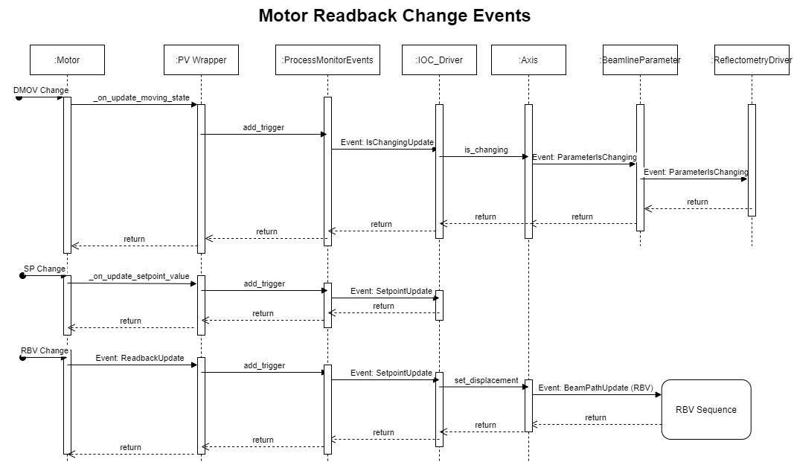

# Geometry Components

A component represents a point of interaction with the beam on the beamline; for example, a slit set or mirror. They form the relationship between:

- the incoming beam: the position in space and angle of the beam which will intersect the components movement
- outgoing beam: the beam path after the beam has interacted with the component (which may or may not be altered)
- user set value relative to the beam: where the user would like an object relative to the beam (e.g. for something on the beam 0mm above the beam) on a given axis (e.g. linear / rotational offset)
- Mantid coordinates: the values for position in the room or of underlying PVs value, often a motor. Theses value don't change based on moving the beam.

In effect, the component layer is responsible for translating motor values/Mantid coordinates (relative to straight-through beam) to high-level parameter values (relative to current beam path) and vice versa.

Each component captures the relationships for both set points (where the user wants the beamline to be) and readbacks (where the beamline actually is) separately i.e. the system maintains two separate models of the beam path. 

**For more information on implementation specifics see the [Beamline Configuration page](#reflectometry_components)**

## Architecture

### Major Classes


The components contains two major elements the beam path setpoint and beam path readback. The setpoint allows positions to be set from user parameters and these setpoints are translated to setpoints on the motor level. The readback takes motor positions and calculates the user parameters from them. Both setpoint and readback attributes use the tracking beam path calc, and subclasses, to perform the calculations. The tracking beam path calc object that perform the calculation try to be generic for both cases, to differentiate between the motor and user level we use the terms relative to beam, for user parameters, and displacement, for motor parameters. This makes sense for the tracking parameters but less so for the direct parameters, which are relative to the fixed beam so also absolute, e.g. for a TRANS axis the beam is always at 0 so relative and displacement will be the same.

The tracking beam path calc has a number of component axes representing a single quantity that can change, e.g. slit 2 height. These must have a variety of methods and attributes. The methods allow the axis value to be read and written in various ways, e.g. relative to beam. The attributes set and show the state of the axis, e.g. changing True when the underlying motor is moving. These states are:

- `is_changing`: an underlying motor is moving
- `is_changed`: a set point has been changed but the change has not been sent to the driving layer
- `alarm`: the alarm status of the axis, usually a reflection of the underlying motor axis
- `is_in_beam`: True if this axis in the beam, i.e. not at its parked position
- `has_out_of_beam_position`: True if the axis has an out of beam position, these are usually set on the driving layer
- `can_define_axis_position_as`: True if the axis can have its position defined as something else
- `autosaved_value`: The value last read from autosave for this axis

There are two sorts of axes, `DirectAxis` and the `BeamPathCalcAxis`. The `DirectAxis` defines the methods above such that there is no transform between relative and displacement values. The `BeamPathCalcAxis` uses the methods from the `TrackingBeamPathCalc` to calculate the various values. The axis object for tracking case points to the methods needed so is not as clean as it should be; but it is unclear exactly how it should change.

In general a component is made from multiple axes and can respond to changes in those axes, the bench component does this for instance. The bench component has 3 user parameters height, angle and seesaw and these drives three drivers front jack, rear jack and slide. All of these changeable values are axes. To make this work the component listen for changes to the values and transform the value applying then to the other set of axes. E.g. if the jack motor moves the position is transformed to the height, angle and seesaw user parameters.

The `InBeamManager` is used to coordinate whether a component is in the beam based on all of its axes. This can either be set from a user parameter in which case user axes get set or it can read from the motor axes for the readbacks. A component is out of the beam only if all its motors are at their out of beam positions.

The most complicated component is the `ThetaComponent` this has two beam calcs one for the readback `BeamPathCalcThetaRBV` and one for the setpoint `BeamPathCalcThetaSP`. The setpoint simply reflects the beam when it reaches the virtual sample point whereas the read back needs to calculate the angle of the component that it is pointed at. 

The final complication is that components that define where theta do not use the readback beam path to calculate there position because this would always be zero, since it defines theta, instead they use the setpoint beam path.

### Events

The whole system of readbacks, and to lesser extend setpoints, work on events being passed between the various classes. We have tried very hard not to bind the components to any of part of the system directly so that the component layer can act independently. To so this events are listened to by the observing classes. This has mostly be successful but it does get slightly complicated to understand what the events are and where the go so we will present what events we have and where they go for a typical beamline.

#### Defining, Triggering and Observing an Event

The event is captured using a single class, this can be whatever you need but the future direction is to use a data class (there are still some legacy named tuples). For example:

```
@dataclass()
class MyEvent:
    """
    doc
    """
    param1: <type name>
    param2: <type name>
```

To make a class observable simply add `@observable(<event>)`:

```
@observable(MyEvent, OtherEvent, ThirdEvent)
class IWantToObserveThis()
...
```

When you want to trigger the event in the class use:

```
self.trigger_listeners(MyEvent(value1, value2))
```

To observe the event you need a call back function which takes the event as an argument to the instance of the class and this will be called when the event is triggered, e.g.

```
def my_callback(event: MyEvent):
   ....

i_want_to_observe_this = IWantToObserveThis()
i_want_to_observe_this.add_listener(my_callback)
```

### Beamline Move Event

A beamline can be moved by the user through three mechanisms (see [beamline object for more detail](Reflectometry-Beamline-Object)):

1. A whole beamline move, in this case all setpoints that are in the mode or have changed are set in turn (i.e. sp becomes the sp:rbv)
    - starts from code `Beamline._move_for_all_beamline_parameters`
1. A single parameter can have its move activates, in this case this set point value is set and beam line is calculated
    - starts from parameter but main part of the code is `Beamline._move_for_single_beamline_parameters`
1. A single parameter is set (`SP` not `NO_ACTION`), this is like a set and then case 2.

#### Beamline move events



In all cases the move is a `set_relative` on the axis in question. Once the axis has been set correctly if it causes the beampath to change then the `BeamPathUpdate` event in propagated. The beamline picks up this event and then propagates the beampath to the next component which triggers `BeamPathUpdate`, and so on until all components in turn have had their beampath updated. Note that this stops at the component layer the motors will not move until later all the events are processed.

At some points the set point is used to calculate the readback value, e.g. for components defining theta. In this case the events will also propagate through the RBV beampath sequence.

#### Motor Readback Change Events



The motors can update in several ways that need propagating through the reflectometry IOC. All events are tied to PV monitors which trigger call backs. These callbacks could come in to the system very quickly and we can not afford to process each one so instead we put a callback for the event into a dictionary and just keep the last value recorded. Then in a loop the events are processed. This happens inside the `ProcessMonitorEvents` object. The events treated in this way are:

1. `DMOV` update this is eventually propagated up the beamline parameters are parameter changing so that a green background can be displayed
1. set point change, this is propagated to the IOC Driver so it is possible to determine if a move will occur (this avoid performing small unneeded moves)
1. rbv change, this is propagated through the beamline sequence to calculate the new positions of all the parameters.

#### Beamline Readback Event Propagation 


The readbacks in each component axis are set based on a change in a single readback. This readback change in a component axis will cause the associated parameter to update, and in turn the reflectometry driver, this is more actual value and whether it is now at its setpoint. Then the component triggers a beam path update which will propagate the beamline to the next component, until all components are updated. 

The only special case for this is theta readback also reacts to a `PhysicalMove` update of the component axis which theta depends on. This causes the beampath the be calculated starting at Theta. The beam path update event can not be reused because otherwise a circular loop would result.

### Other Important Part of the Geometry Layer Code

`LinearMovementCalc`: Geometry calculations

