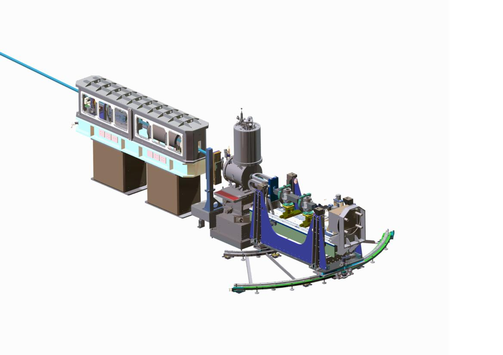
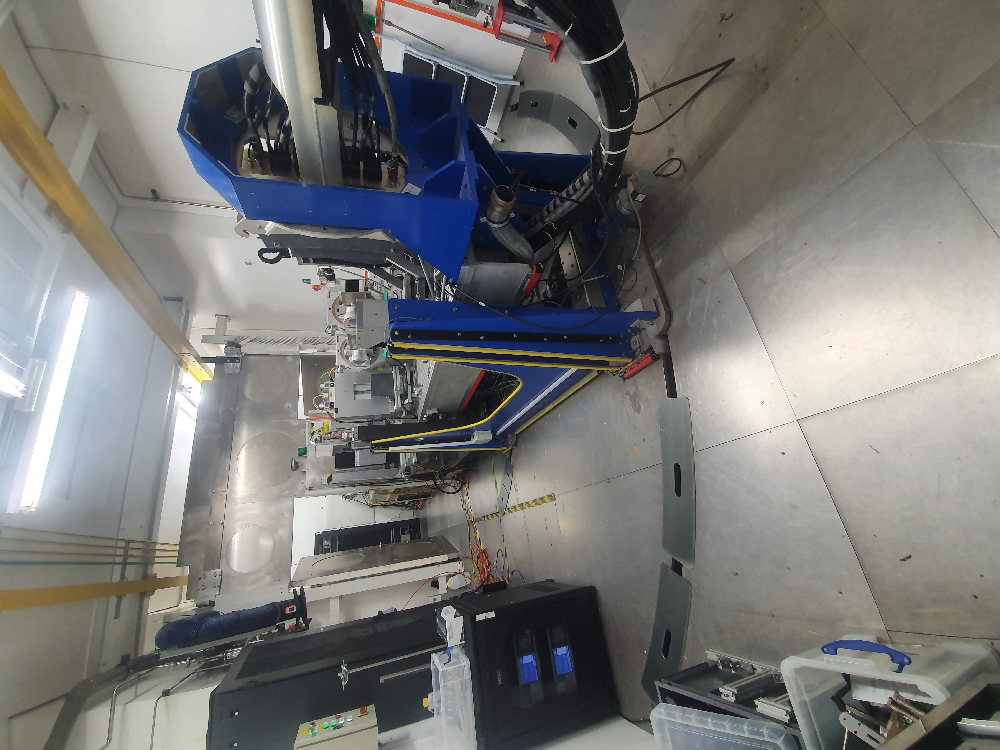

# Reflectometry IOC - POLREF

Specific information about POLREF.

|   |   |
|---|---|
|   |    |

## Axes

Axes when sample is in horizontal configuration. 

In vertical configuration CHI and Theta/PHI/ANGLE are swapped, as are x and y axes. NB slit directions are not so in vertical mode the collimation is controlled by the horizontal slits.

### Specific Axes by Operation Mode

Below is an overview to explain which terms relate to each other in horizontal/vertical mode (differences highlighted):

  
Slit 2

#### Horizontal Mode

| Block          | Parameter Name      | Change Axis in REFL | Motor       | Motor Name       | General term     | Other |
| -------------  | ------------------- | -------------- | ----------- | ---------------- | ---------------- | ---- |
| S2OFFSET | S2OFFSET              | POSITION               | 0402 | Slit 2 Z     | Slit 2 Height   | - |
| S2ANGLE | S2ANGLE              | ANGLE               | 0605 | Slit 2 Tilt     | Slit 2 Tilt   | - |

#### Vertical Mode

| Block          | Parameter Name      | Change Axis in REFL | Motor       | Motor Name       | General term     | Other |
| -------------  | ------------------- | -------------- | ----------- | ---------------- | ---------------- | ---- |
| S2OFFSET | S2OFFSET              | POSITION               | **0305 / 0306** | **Slit 2 East / West**     | **Slit 2 Horizontal**   | **Using HCENT as Offset** |
| **S2CHI** | **S2CHI**              | **CHI**               | 0605 | Slit 2 Tilt     | Slit 2 Tilt   | - |

  
Frame Overlap Mirror (FOM)

#### Horizontal Mode

| Block          | Parameter Name      | Change Axis in REFL | Motor       | Motor Name       | General term     | Other |
| -------------  | ------------------- | -------------- | ----------- | ---------------- | ---------------- | ---- |
| FTHETA         | FTHETA              | ANGLE               | 0205 | FOM Theta     | FOM Theta   | - |
| FCHI           | FCHI                | PSI                 | 0206 | FOM Chi     | FOM Psi  | - |
| FOFFSET        | FOFFSET             | POSITION            | 0208 | FOM Z     | FOM Height   | - |
| FTRANS         | FTRANS              | TRANS               | 0207 | FOM Y     | FOM Trans   | - |

#### Vertical Mode

| Block          | Parameter Name      | Change Axis in REFL | Motor       | Motor Name       | General term     | Other |
| -------------  | ------------------- | -------------- | ----------- | ---------------- | ---------------- | ---- |
| FTHETA         | FTHETA              | ANGLE               | 0205 | FOM Theta     | FOM Theta   | **-2.3 correction** |
| FCHI           | FCHI                | PSI                 | 0206 | FOM Chi     | FOM Psi  | **+90.0 correction** |
| FOFFSET        | FOFFSET             | POSITION            | **0207** | **FOM Y**     | **FOM Trans**   | - |
| FTRANS         | FTRANS              | TRANS               | **0208** | **FOM Z**     | **FOM Height**  | - |

  
Polarizing Mirror

#### Horizontal Mode

| Block          | Parameter Name      | Change Axis in REFL | Motor       | Motor Name       | General term     | Other |
| -------------  | ------------------- | -------------- | ----------- | ---------------- | ---------------- | ---- |
| SMANGLE         | SMANGLE         | ANGLE               | 0301 | Polarizer THETA     | Polarizer Theta   | - |
| SMCHI           | SMCHI           | PSI                 | 0302 | Polarizer CHI     | Polarizer Psi  | - |
| SMOFFSET        | SMOFFSET        | POSITION            | 0304 | Polarizer Z     | Polarizer Height   | - |
| SMTRANS         | SMTRANS         | TRANS               | 0303 | Polarizer Y     | Polarizer Trans   | - |

#### Vertical Mode

(Polarizer not currently used in vertical mode - NR only)

| Block          | Parameter Name      | Change Axis in REFL | Motor       | Motor Name       | General term     | Other |
| -------------  | ------------------- | -------------- | ----------- | ---------------- | ---------------- | ---- |
| SMANGLE         | SMANGLE         | ANGLE               | 0301 | Polarizer THETA     | Polarizer Theta   | **-2.3 correction** |
| SMCHI           | SMCHI           | PSI                 | 0302 | Polarizer CHI     | Polarizer Psi  | **+90.0 correction** |
| SMOFFSET        | SMOFFSET        | POSITION            | **0303** | **Polarizer Y**     | **Polarizer Trans**    | **Park position correction** |
| SMTRANS         | SMTRANS         | TRANS               | **0304** | **Polarizer Z**     | **Polarizer Height**   | - |

  
Sample Stack

#### Horizontal Mode

| Block          | Change Axis in REFL | Parameter Name | Motor       | Motor Name       | General term     |
| -------------  | ------------------- | -------------- | ----------- | ---------------- | ---------------- | 
| Height         | POSITION            | SAMPOFFSET     | 0403     | SS Low Z         | Coarse Height    |
| Height2        | HEIGHT              | SAMPHEIGHT     | 0404     | SS High Z        | Fine Height      |
| Sample_Changer | -                   | -              | 1001     | Sample Changer   | Sample Changer   | 
| Trans          | TRANS               | TRANS          | 0405     | SS Horizontal    | Trans            |
| PHI            | ANGLE               | PHI            | 0407     | SS Lower Gonio   | Phi              |
| PSI            | PSI                 | PSI            | 0406     | SS Upper Gonio   | Psi              |
| CHI            | CHI                 | CHI            | 0408     | SS Rotation      | Chi              |

#### Vertical mode:

| Block          | Change Axis in REFL | Parameter Name | Motor       | Motor Name       | General term     |
| -------------  | ------------------- | -------------- | ----------- | ---------------- | ---------------- | 
| Height         | POSITION            | SAMPOFFSET     | **0405** | **SS Horizontal**| Trans            |
| Height2        | -                   | -              | -           | -                | -                |
| Sample_Changer | -                   | -              | -           | -                | -                |
| Trans          | TRANS               | TRANS          | **0403** | **SS Low Z**     | Coarse Height    |
| PHI            | ANGLE               | PHI            | **0408** | **SS Rotation**  | Chi              |
| PSI            | PSI                 | PSI            | 0406     | SS Upper Gonio   | Psi              |
| CHI            | CHI                 | CHI            | **0407** |**SS Lower Gonio**| Phi              |

  
Bench

#### Horizontal mode:

| Block          | Change Axis in REFL | Parameter Name | Motor       | Motor Name       | General term     |
| -------------  | ------------------- | -------------- | ----------- | ---------------- | ---------------- | 
| BENCHOFFSET    | POSITION            | BENCHOFFSET    | 0801 / 0802 | Bench Front Z/ Bench Rear Z    | Bench Height   |
| BENCHANGLE     | ANGLE               | BENCHANGLE     | 0801 / 0802 | Bench Front Z/ Bench Rear Z    | Bench Angle    |
| BENCHSEESAW    | SEESAW              | BENCHSEESAW    | 0801 / 0802 | Bench Front Z/ Bench Rear Z    | Bench Seesaw   |
| BENCHCHI       | CHI                 | BENCHCHI       | 0804     | Bench Arc        | Bench Chi        | 

#### Vertical mode:

| Block          | Change Axis in REFL | Parameter Name | Motor       | Motor Name       | General term     |
| -------------  | ------------------- | -------------- | ----------- | ---------------- | ---------------- | 
| **BENCHTRANS** | **TRANS**           | **BENCHTRANS** | 0801 / 0802 | Bench Front Z/ Bench Rear Z    | Bench Height   |
| **BENCHCHI**   | **CHI**             | **BENCHCHI**   | 0801 / 0802 | Bench Front Z/ Bench Rear Z    | Bench Angle    |
| BENCHSEESAW    | SEESAW              | BENCHSEESAW    | 0801 / 0802 | Bench Front Z/ Bench Rear Z    | Bench Seesaw   |
| **BENCHANGLE** | **ANGLE**             | **BENCHANGLE** | 0804     | Bench Arc        | Bench Chi        | 

{#refl_polref_beam_blocker}
## Slit 3/Beam blocker

Slit 3 is a tall set of normal jaws sitting on the bench. In horizontal sample mode the centre of the jaws is set using the `S3OFFSET` parameter which sets the distance from beam to the jaws, (usually set to 0). The bench movement means that the centre of the jaws rarely needs to change except during a slit scan.
Slit 3 can also be set into [beam blocker mode](../Reflectometry-Beam-Blocker); south jaw in horizontal mode, east or west jaws in vertical sample mode. In this state the beam blocked jaws will move independently of the slit centre using `S3S` and `S3N` or `S3W` and `S3W`. They retain the natural jaw directions so that positive is away from the centre of the jaw.

## Components on the Bench

Components that are on the bench do not track the beam in the same way as normal components. They rely on the underlying bench to track the beam and then their positions are just relative to the bench. This will in effect look the same as if they were tracking the beam but they don't.

## Blocks

Blocks that may be confusing:

- `Height`: Distance between the beam and the centre of rotation; usually set a 0. This moves the course z stage tracking the beam.
- `Height2`: Distance from the sample centre of rotation to the sample. This is used to align the sample with the beam.

## Parameter Autosave

It is hard to know which parameters to autosave and which not to. Probably with use we will find out. I have gone with Theta and polariser angles are not autosaved all other heights and offsets are. So that when coming back from SECI the setpoints will mirror those in SECI quite closely. Other axis parameters, direct parameters and slits are not autosaved so they come back as they are, except for bench angle offset and seesaw which are autosaved.

## Initial Testing

[Testing results are here](tests_POLREF_2020_08_20.xlsx).

Issues were:

1. On running the routine for transferring the SECI motor setups to IBEX, all the encoders were turned off. This may be a one off thing but still it should happen.
    - This was because I ran the original motor setup in sim mode. Yes this should not happen, I have added it to the information page so it won’t happen again.
1. There was a request for a command in python for interrogating a motor e.g `pos Phi`  and it tells you all sorts of things about phi like its position offset limits etc. that could then be used in a script.
    - We will probably never get to this if we put it on our list. I will send some details describing how you might create such a script let me know if you need help.
1. There again also seemed to be an issue with High and low limits being the wrong way around as well as directions not being correct after the transfer. 
    - For all axes on the spreadsheet I have confirmed that they are wrong in SECI; there is nothing we can do about this.
1. Where Dual position was marked in the SECI motor table there were issues of odd behaviour in IBEX that will need fixing. This affects the PolREF current sheet.
    - [Ticket 5647](https://github.com/ISISComputingGroup/IBEX/issues/5647) 
1. The major issue was that the IBEX setpoints were not transferred back to SECI when switching form IBEX back to SECI. The current positions were. This means that if someone reboots SECI and then presses move then the beamline will move unexpectedly. This is not good and needs a fix of some kind as it could lead to crash’s I know future wise we should all be in IBEX but for the next year I can see people switching back and forth,
    - I think that a script the user can run in OpenGenie is probably the best idea so that they have control over when they want they readbacks to be the same as the setpoint. Please read and approve [5648](https://github.com/ISISComputingGroup/IBEX/issues/5648). 
1. Labels that were the wrong way around such as the laser Gimbal axes theta and chi. We swapped them but not necessarily in the config, Also for some reason the PolREF sample stage had phi and Psi the wrong way around and again I am not sure they were swapped to the correct position fully.
    - Gimbal is wrong in SECI
    - PSI and CHI was my mistake in the config the motors are gonio upper and lower and I guessed the wrong way round. Now fixed in config.
1. `Stop_ibex_server_start_seci` does not finish. It starts seci but waits for SECI to finish, which is not what we want. Make it start in separate console.
    - [#5651](https://github.com/ISISComputingGroup/IBEX/issues/5651) 
1. There was an error loading programs into SECI this has been fixed by combining programs in the galil.
1. There is something wrong with the bench movement. We think that it is because it was not synced and the max bench angle had not been implemented. (Extra note we tried moving the bench but had problems so we then set the motion of the slide to not be synchronised, then reversed the slide but we never set synchronised on the movement again)
    - We should retest this after completing [#5541](https://github.com/ISISComputingGroup/IBEX/issues/5541) 
1. Jaw 1 was synchronised and should not be (jaws in general are not synchronised to avoid clashing).
    - Changed in config
1. Some errors in the logs for which I have created tickets
    - [#5649](https://github.com/ISISComputingGroup/IBEX/issues/5649)
    - [#5650](https://github.com/ISISComputingGroup/IBEX/issues/5650)
1. Height and Height2 point at the same thing on the OPI
    - Corrected in master
1. Check backlash on slits is ok, currently move is towards centre of slit them slowly out to position.
