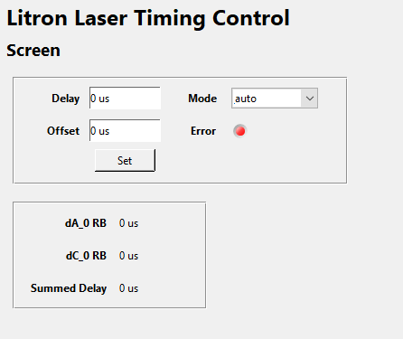

# Stanford DG645 (Litron Laser Timing)

Litron Laser Timing Control is an extension of the DG645 IOC made for HIFI to use. It replaces the LabView functionality as described [here](https://github.com/ISISComputingGroup/IBEX/issues/6089#issuecomment-2102423879). To enable the Litron Timing mode in the DG645 IOC, put 'LITRON' in the 'APPLICATION' macro.



## Delay & Offset

By setting a delay and offset the following calculation is done.

`dA_0 = Delay + Offset` in `us`

Under the following constraints:

```
If mode is 1:
    if dC_0 + Delay + Offset > 39900 us
        or Delay + Offset < 0 us
    then:
        Error State
  
Else if mode is 2:
    if Delay + Offset > 39900 us
        or dC_0 + Delay + Offset <= 0 us
    then:
        Error State
```

## Mode

When the user tries to set the mode then the following is applied:

```
If IOC mode is 1 or 2 then:
    Set device mode to be 1 or 2 respectively

else: # IOC mode is auto

    if Delay > Offset then:
        Set device mode to 1

    else:
        Set device mode to 2
```
Note that IOC mode is not the same as device mode. IOC mode refers to a value of `auto` or `1` or `2`, the device mode refers to which configuration/setting slot the DG645 is in (0-9). IOC mode 1 and 2 refers to device setting slots 1 and 2.

As of writing auto mode has not been tested on device/instrument as not yet needed.

## Summed Delay

`Summed Delay = dA_0 + dC_0`

## Other
- Unlike the DG645 IOC- when the user changes the device mode, we do not restart the IOC. We chose not to as we need to know at any point what the device mode is for error checking- if we restart the IOC then we lose track of what the device mode is.
- The original specification for Litron Laser Timing Control states that `dA_0` and `dC_0` should be polled at 4Hz. We chose to keep the original polling rate of the DG645 at 1Hz.
