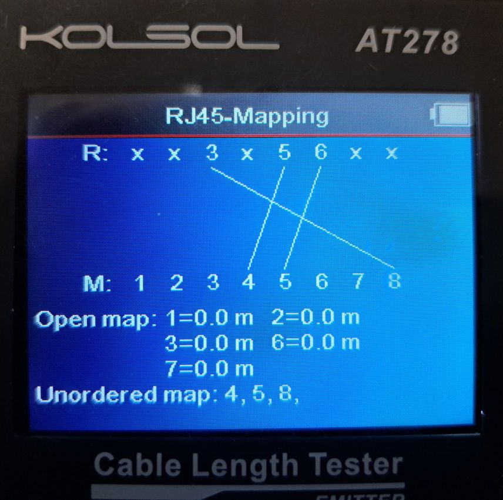

# PR Electronics PRE4500

## Background

This device is used to measure the temperature of chopper disks, housings and pits.  There are currently two installations, one on MERLIN for its Fermi chopper, and one on SANDALS for its disk choppers.

Each of the installations uses a single module per temperature/channel (four currently), connected on a backplane with a communications module.

The IOC and repository are named PRE4500, athough the actual module IBEX communicates with is a "PRE4511 MODBUS communication enabler" using MODBUS RTU (Remote Terminal Unit) over RS-485.

This means that a MOXA NPort capable of RS-485 communication is required, namely in the latest installation on SANDALS, an NPort 5650-16.  The serial settings for the appropriate port need to be set to RS-485 2-Wire.

### Bespoke Cable

Both the PRE4511 and MOXA NPort use RJ45 (8P8C) device sockets (PRE4511 brought out to rear of chassis).  It is therefore simpler to use a bespoke cable to connect them rather than a host of converters and adapters.

#### Pinouts for communications cable using an 8P8C (aka RJ45) plug at each end:

| MOXA NPort | PRE4511 | Colour |
| ---------- | ------- | ------ |
| 3 | 8 | Brown |
| 5 | 4 | Blue  |
| 6 | 5 | Blue/White |

Discarded CAT5 patch cables were used to make up the cables by cutting off the broken plugs and crimping on new ones (ExptCtrls Group has appropriate equipment).  Arbitrary colour internal conductors were chosen for the three signals (see table above), although any can be used.

After making the cable, it should be tested using the "Kolsol Tester" (aka "Excellent Helper") in 'Mapping' mode, and if all is well, the pin-to-pin mapping should look like the screenshot below.  In this case, the MOXA NPort end of the cable was connected to the Remote unit (`R` in the screenshot) and the PRE4500 end to the main unit (`M` in the screenshot).

## IOC Setup
 macros.

## Implementation
