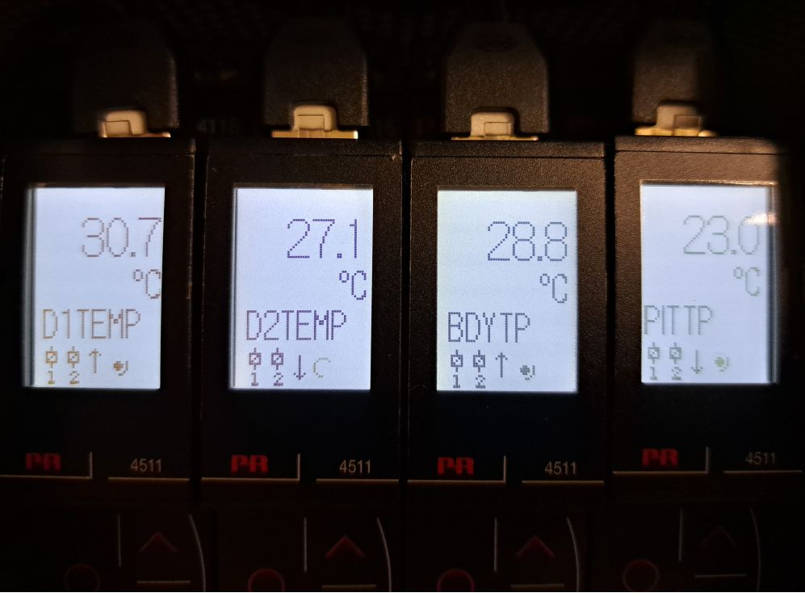
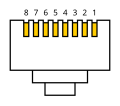

# PR Electronics PRE4500

``` {note}
The IOC and repository are named PRE4500, although the actual device IBEX communicates with is a "PRE4511 MODBUS communication enabler", using MODBUS RTU (**R**emote **T**erminal **U**nit) over RS-485.  (Manual in usual network shared directory).
```

## Background

This device is used to measure the temperature of chopper disks, housings and pits.  There are currently two installations, one on MERLIN for its Fermi chopper, and one on SANDALS for its disk choppers.

A single module per temperature/channel is used (four currently).  See below for SANDALS installation (located in top of chopper rack on ground floor):



## Connection to control system

The device requires a MOXA NPort capable of RS-485 communication, e.g. an NPort 5650-16.  The serial settings for the appropriate port need to be set to `RS-485 2-Wire` via the web configuration interface.

### Bespoke Cable

As the device communicates via RS-485 (**not** RS-232 as the vast majority of devices at ISIS do), a standard MOXA cable and adapters cannot be used.

Both the PRE4511 and MOXA NPort use RJ45 (aka 8P8C) device sockets (PRE4511 brought out to rear of chassis).  It is therefore simpler to create a bespoke cable to connect them.

#### Pinouts for communications cable using an RJ45 (aka 8P8C) plug at each end:

``` {tip}
The following diagram shows the pin numbering while looking **end-on** to the plug with the cable going **away** from the viewer ('barb' underneath):


[Image source](https://commons.wikimedia.org/wiki/File:8P8C_plug_pin_diagram.svg)
```

| MOXA NPort | PRE4511 | Colour     |
| ---------- | ------- | ------     |
|     3      |    8    | Brown      |
|     5      |    4    | Blue       |
|     6      |    5    | Blue/White |

Discarded CAT5 patch cables were used to make up the new ones by cutting off the broken plugs and crimping on replacements (ExptCtrls Group has appropriate equipment).  Arbitrary colour internal conductors were chosen for the three signals (see table above).

After making the cable, it should be tested using the "Kolsol Tester" (aka "*Excellent Helper*") in 'RJ45 Mapping' mode.  If all is well, the pin-to-pin mapping should look like the screenshot below:


In this case, the MOXA NPort end of the cable was connected to the Remote unit (`R` in the screenshot) and the PRE4500 end to the main unit (`M` in the screenshot).

``` {important}
Any new cables should be clearly labelled to indicate their use as they could easily be confused with Ethernet patch cables.
```

## IOC Setup

There is a single macro for the COM port.

## IBEX client

Device screens and Synoptic use the target, `PRE4500`.  OPI is named `pre4500.opi`.
