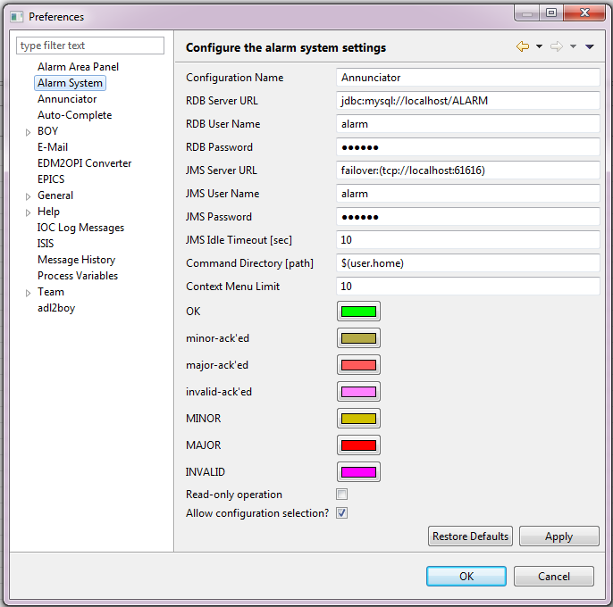

# Alarms

## Contents
* [Useful links](#useful-links)
* [Architectural overview](#architectural-overview)
* [JMS server](#jms-server)
* [Alarm server](#alarm-server)
* [Alarm database](#alarm-database)
* [Eclipse clients](#eclipse-clients)
* [Default connection details](#default-connection-details)

## Useful links

```{toctree}
:glob:
:maxdepth: 1
:titlesonly:

alarms/*
```

* [CSS book](http://cs-studio.sourceforge.net/docbook/ch14.html)

## Architectural overview
The architecture of the alarm system as used in CSStudio is presented in detail in [Chapter 14](http://cs-studio.sourceforge.net/docbook/ch14.html) of the CSS book. The implementation used by ISIS is very similar though a few features which we do not need have been removed. Overall, the architecture is very similar to that of the [IOC log](IOC-message-logging). 

The configuration of an alarm system, that is, the set of PVs which are to be monitored, is stored in a relational database. The configuration can be a flat list of PVs or the PVs can be formed into a hierarchy with systems and sub-systems.

The alarm server reads the configuration from the database and continuously monitors the specified trigger PVs and detects whenever one of the them goes into an alarm state. When this happens, the server updates the PV's record in the database and sends a message to all listeners (Eclipse clients) via JMS (Java Message Service).

For each instrument, there will be a single instance of the alarm server, JMS server and database server, probably all on the same machine.

## JMS server
The JMS server implementation used is Apache [ActiveMQ](ActiveMQ), an instance of which is started up along with the IOC log server. See the [IOC log](IOC-message-logging) page for details.

## Alarm Server
The alarm server can be found in `EPICS/CSS/master/AlarmServer`. Currently it is a pre-built version. It would be useful to have a version with source code that can be modified in Eclipse and built as part of the Jenkins build. Only the plugin 'org.csstudio.alarm.beast.server' would be needed.

The server can be started by running the script 'run_alarm_server.bat'. The alarm 'root configuration' that the server uses is specified as a command-line argument; the name of the root that will be used may be set by editing the value in the 'config_name.ini' file. Other settings for the alarm server including the database and JMS server connection settings, are found in the file 'alarm_server_settings.ini'.

The settings for which PVs are watched by the alarm server are set using the AlarmServerConfig tool. In a similar way to the [ArchiveEngines](CSS-Archive-Engine). The script in `AlarmServer\make_alarm_config.py` creates the xml that the config tool reads and populates the alarm server with. This xml is created based on the running IOCs as specified in the mySQL db.

There is also a script (procserv_start.bat) to start that alarm server wrapped in procserv, but this doesn't appear to work correctly at the present time.

## Alarm database

The alarm server directory, `EPICS/CSS/master/AlarmServer` contains SQL files that can be used to create the appropriate tables (for MySQL, Oracle, and Postgres) in a SQL database for use by the alarm system. Note these files are also contained in the CSS source code, in the plugin org.csstudio.alarm.beast.

It is also necessary to set up the appropriate database user accounts for the server and for the clients ( see [default connection details](#default-connection-details) below).

If you are using a MySQL database, simply run the commands in the file 'ALARM_MYSQL.sql' to set up the tables and those in 'MYSQL_USER.sql' to set up the default user accounts.

## Eclipse clients

The target platform includes the feature 'Alarm Handler UI' which contains all the code for the alarm UI elements and for interacting with the alarm database and the JMS message server. The following additional plugins are required by this feature:

* org.csstudio.platform.utility.jms
* org.csstudio.platform.utility.rdb
* org.csstudio.platform.libs.jms
* org.csstudio.platform.libs.jdbc
* org.csstudio.security
* org.csstudio.security.ui
* org.csstudio.logging

These are all included in 'org.csstudio.isis.feature.css, so you shouldn't have to worry about them.

Currently the alarm handler functionality is added to the client through the plugin 'org.csstudio.isis.ui.alarm'. This simply provides a perspective, which contains the 'Alarm Tree' widget, to the perspective switcher.



## Default connection details

* JMS server address: failover:(tcp://localhost:39990)
* SQL server address: jdbc:mysql://localhost/ALARM
* SQL server username (read/write): alarm
* SQL server password (read/write): $alarm
