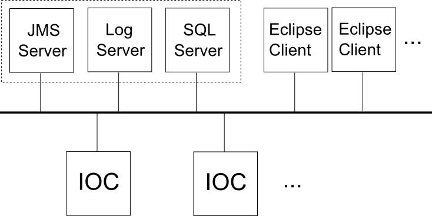

# IOC Message Logging

## Logging Architecture Overview

Each IOC has some functionality to dispatch any log messages it generates to a listening IOC log server, the address and port of which must be known to the IOC. 

Assuming that the log server is active, the IOC will automatically connect to the log server on start-up and send any messages on to it as soon as they arise.

EPICS base includes a simple IOC log server that writes log messages to a text file. We have replaced this with our own server written in Java that has much more functionality.

Our Java log server may connect to any number of IOCs. It processes incoming messages, formats them appropriately, and then dispatches them using a messaging service called [Java messaging service, JMS](http://en.wikipedia.org/wiki/Java_Message_Service).

A JMS server receives these reformatted messages and forwards them on to any subscribers (e.g. Eclipse clients). 

The log server also saves all messages to a relational database (SQL). Messages may then be retrieved at any time from the database by interested clients (again, Eclipse clients).

It is likely that the Log server, JMS server, and Database server will all live on the same physical machine.




## Log Server

The log server is written in Java and may be found in the directory `EPICS/ISIS/IocLogServer/`.

Also included in this directory are an instance of Apache [ActiveMQ](ActiveMQ) (a JMS server implementation), some tools written in python to aid development, and some start-up and build scripts.

### Functionality

Once the log server is started, it will automatically attempt to connect to the JMS server and the SQL database server (the connection details for each are currently hardcoded but will be moved to external config files in the future). 

If the log server cannot connect to either, or if the connection to either is dropped at any point while the log server is running, it will automatically attempt to re-establish connection (and keep trying every few seconds until it is re-established).

The log server will then attempt to listen for IOC messages on a set of ports (again hardcoded, to be moved to config file in the future). Any messages received are (i) converted into and XML format and forwarded on to the JMS server; (ii) saved to the SQL database.

The connection to both the JMS server and the database are independently buffered so that if connection to either is lost, the log server will wait to re-establish connection before sending on any messages, so that no messages should be dropped. The log server will wait a few seconds after re-establishing connection to the JMS before sending any messages, in order to give JMS clients a chance to reconnect to the JMS server themselves.

### Development
To develop the log server, first run the script `/IocLogServer/LogServer/make-eclipse-project.bat`. This will create Eclipse `.project` and `.classpath` files and a `.settings` folder. Next, create a new directory in `/IocLogServer` called workspace. Open [Eclipse](https://www.eclipse.org/) and select this new folder as the workspace. (I have added my version of the project files into the project so you may no longer need to do this).

Import the log server project (File > Import > General > Existing Projects into Workspace > folder EPICS/ISIS/IocLogServer/base.

To run the server from Eclipse, right click on the project folder, click: run as > run configurations. Set the main class as 'org.isis.logserver.server.IOCLogServer' and click 'Run'.

### Building and Running
The log server is built using [Apache Maven](http://maven.apache.org/). A maven `pom.xml` file is included in the project. To build, install maven on your computer and run the batch file `build-log-server.bat` found in the directory EPICS/ISIS/IocLogServer/. This will create a runnable jar file.

The server can be launched by running `start-log-server.bat`.

To test the functionality, you should also launch the JMS server by running `start-jms-server.bat`. You can test that message passing works correctly by using the demonstration IOC and demonstration JMS client detailed in the development tools section below.

See the database server section below for details on how to set up a test SQL database.

Instructions to build the log server are included as part of the [Jenkins](http://epics-jenkins.isis.rl.ac.uk/) build script ([EPICS/jenkins_build.bat](https://github.com/ISISComputingGroup/EPICS/blob/cad660a01a2c8e648a37372ad6e11deb26e7eb1e/jenkins_build.bat))

The log server and JMS server should be started automatically when running the script /EPICS/start_inst.bat. The startup details are in the script EPICS/logserver/start_log_servers.bat.

## JMS Server
The JMS server implementation used is [Apache ActiveMQ](http://activemq.apache.org/). ActiveMQ comes bundled with the log server and a start-up script for it is included ('start-jms-server.bat'). No configuration is required for ActiveMQ; simply run the start-up script and it will be ready in a few seconds. The start-up script is also run as part of the IOC start-up script (EPICS/start_inst.bat).

Message producers (the log server) and consumers (Eclipse-based clients) interact through the JMS by subscribing to a 'topic'. Any message that a producer sends to the topic is immediately forwarded to all consumers who are currently subscribed to the topic.

JMS does not buffer topic messages so any consumer who is not connected to the JMS server and subscribed to the topic when the server receives the message will not have the message forwarded to them.

The Topic for IOC log messages is '/topic/iocLogs'.

The default port for sending and receiving JMS messages on ActiveMQ is 61616. However, we have switched to using 39990 to keep it in the fixed port range and avoid clashes.

## Development Tools
In the subdirectory '...\EPICS\ISIS\IocLogServer\master\dev-tools' are a number of python scripts to aid in development and debugging of the log server and eclipse clients that consume log messages.

The first, 'jms_client.py', connects to the JMS server and receives any messages forwarded by it. This can be used to test if the log server is correctly forwarding on messages.

The connection details used (JMS server address, port, topic name) are found in 'jms_details.py'.

The second tool is 'ioc_message_simulator.py' which connects directly to the log server and can be used to simulate messages coming from IOCs.

These tools may be started using the batch files: 'start-jms-demo-client.bat' and 'start-ioc-demo.bat' respectively.

Another tool that may be of use in analysing problems relating to the connection between two programs is [TCPView](http://technet.microsoft.com/en-gb/sysinternals/bb897437.aspx). This displays a list of active TCP connections including port numbers to and from processes on your machine.

## Database Server

You can use [MySQL workbench](http://www.mysql.com/products/workbench/) as a MySQL development server.

The file EPICS/ISIS/IocLogServer/log_mysql_schema.txt contains a sequence of SQL commands that will create the appropriate schema for use by the log server and clients.

## Eclipse Clients

The IOC log message handling in the Eclipse client consists of two main plugins: `org.csstudio.isis.log` (model) and `org.csstudio.isis.ui.log` (view). Additionally, the plugin `org.csstudio.isis.product.model` contains the `LogMessage` class that represents an individual log message, and the `LogMessageFields` enumeration which enumerates all the fields in a log message as well as providing a display name and a database tag name for each field.

### Model Plugin

The log model plugin starts automatically when the Eclipse client is launched. On launch, it runs an instance of a JMS handler class which listens continuously for new messages from the JMS server. Any messages received are parsed (from their XML representation) into '!LogMessage' objects and passed on to any subscribers (typically view components).

The model also provides for the facility to search a database for log messages. Searches may be performed by string matching on any log message field and may be constrained according to a start and end time.

Clients of the model (i.e., the view) may subscribe, receiving any new log messages from the JMS. The model stores a local cache of all recently received messages which clients may access. This means that a client will not miss any messages received between the time the programs startsup and the time the client is instantiated.

The model plugin also provides an Eclipse preference page with a class that implements `!IWorkbenchPreferencePage`. This page allows the user to configure settings that control the connection to the JMS server and to the database server. These settings are saved to disk so are persistent between uses of the Eclipse client. Changes to these settings take effect immediately.


### View Plugin


#### Search filter Vs Severity Filter
The search filter will set the field that user want their search to be on. for e.g. if `content` is selected then the it will look for user specified text in `content` field of the log messages.

The severity filter will make sure that only the messages above the selected filter is displayed. for e.g. if `information` severity is selected then only the logs with information severity or higher will be displayed.

In short, search filter will search the messages based on the filter and severity filter will then further filter out the messages based on selected severity level.
### Development

When launching the Eclipse client, it is useful to have the JMS Server, the Log Server, and an appropriately configured MySQL Server instance running. You should also set the appropriate settings options in the the log server preference page.

If the Eclipse client cannot find the JMS server, it will periodically re-attempt to connect to it, and print a console message saying so. If the log server is not running, the Eclipse client will show no indication (as it does not connect to the log server directly), however no new log messages will be dispatched by JMS or saved to the database. If the database is not running, attempting to perform a message search will not work and a warning message will be displayed.

## Log Message Format

A log message may contain the following fields

* `contents` 	- The text content of the message.
* `eventTime`	- The time when the message was generated (as recorded by the IOC).
* `createTime`	- The time when the message was received by the log server.
* `type`		- The type of the message (possible values to be determined).
* `severity`	- The message severity (possible values to be determined).
* `clientName`	- The name of the IOC (as supplied by the IOC in its message).
* `clientHost` 	- The name/address of the machine that the IOC is on.
* `applicationId`	- The application that processed the message (typically log server).
* `repeatCount`	- The number of times the message has been repeated in succession.

The log server converts log messages into a simple XML format before dispatching them via JMS. 

The message should always include opening and closing 'message' tags and may include one each of the above fields (the tag name is the same as that given above). Any of these may be omitted.

A typical message might look like:

```
<message>
    <contents>Unable to access PV: 'PREFIX:IOC_NAME:PV_NAME'</contents>
    <severity>ERROR</severity>
    <eventTime>2014-07-16 15:45:27</eventTime>
    <clientName>GALIL_06</clientName>
    <type>ioclog</type>
</message>
```

## Default Connection Details

* Default IOC log port: 7004
* IOC caput log port: 7011
* Log server address: localhost
* JMS server address: localhost
* JMS server port: 39990
* JMS message topic: iocLogs
* SQL server address: localhost
* SQL server port: 3306
* SQL server schema: msg_log
* SQL server username (read-only): msg_report
* SQL server password (read-only): $msg_report
* SQL server username (read/write): msg_log
* SQL server password (read/write): $msg_log
