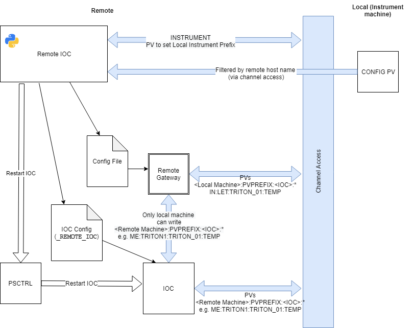

# Remote IOC Server

Remote IOCs are used when:
- There is a piece of equipment that is mobile (i.e. not a permanent part of any beamline)
- Diagnostics from the equipment are useful even when it is not connected to any beamline
- The kit is physically capable of running an IOC

The first piece of equipment to use this is likely to be the Triton dilution fridges.

## Setup

1. Configure the remote PC like a mini-inst, but with an empty `startup.txt` so that it starts no IOCs.
1. Run `start_ibex_server.bat` so that appropriate services (e.g. `PSCTRL`, `conserv`) start
1. Run `call C:\Instrument\Apps\EPICS\ISIS\inst_servers\master\start_remote_ioc_server.bat` on the remote PC to start the remote IOC server.
1. Run `caput -S %MYPVPREFIX%REMIOC:INSTRUMENT IN:<local instrument>:` to configure the remote ioc server to point at the relevant instrument
1. On the instrument control NDX computer, go to the IBEX configuration menu and set the "Remote PV prefix" for the IOC to the prefix of the remote machine (e.g. `ME:<name of equipment>:`)
1. To see the needed field in the GUI set `ALLOW_REMOTE_PV_PREFIX_CHANGE` to true. (`uk.ac.stfc.isis.ibex.ui.configserver/src/uk/ac/stfc/isis/ibex/ui/configserver/editing/iocs/dialog/EditPanel.java`)

## Architecture:

### Setting configuration parameters (macros, pv sets, etc)

Local PC (NDX instrument control computer):
- User edits configuration in GUI. There is a new option to select the "remote pv prefix" - if non-empty, this signifies that the IOC will run remotely.
- The local blockserver receives the configuration and saves it as normal. The "remote pv prefix" property is stored in the configuration XML.
- The blockserver does not stop/start/restart any local IOC if it is marked as having a remote PV prefix.

Remote PC:
- The remote PC is configured to monitor a given instrument. This configuration must be done locally (on the remote PC). Currently this is done by `caput -S %MYPVPREFIX%REMIOC:INSTRUMENT TE:NDW1799:` to monitor `NDW1799`'s configuration.
- The remote ioc server sets up an EPICS monitor on the blockserver of the configured instrument
- When the remote ioc server gets a monitor, it writes the parts of the config which have the same remote pv prefix as itself to file (in XML format, same as what the blockserver uses).
- After writing the config XML, it restarts all of the IOCs which it's looking after

### Ioc running status

To be done in https://github.com/ISISComputingGroup/IBEX/issues/4467

### Interesting PVs

To be done in https://github.com/ISISComputingGroup/IBEX/issues/4468

### Alarms

To be done in https://github.com/ISISComputingGroup/IBEX/issues/4466

## Archiving

Some IOCs run on remote systems (e.g. Tritons after [ticket 3125](https://github.com/ISISComputingGroup/IBEX/issues/3125)). This page describes the *instrument* archiver functionality for these IOCs.

There are essentially 3 places where data could be logged:

### On the remote PC

We are not doing this as there are concerns about how we would monitor resource use for a PC which is not on the network. It could be done in future by running a normal MySQL / archiver setup on the remote PC.

### Centrally

This is, at least initially, where all data from all remote IOCs will be being archived.

The central archiver is running as a service on `control-svcs` (passwords on the usual sharepoint page). The archiver is in `/home/epics/EPICS/CSS/master/ArchiveEngine/` and the settings are in `archive_config_central.xml`.

The archiver is running as a service, after modifying the archive configuration file it needs to be restarted using `systemctl restart epics_archiver.service`

### Onto the instrument archive

This is not being done initially as it is hard. What would need to be done to make this happen is:
- Some service running on the instrument PCs that the remote IOC can push archived PVs to.
- This service would need to merge the archived PVs from all connected remote IOCs
- The service would probably need to translate the remote PVs (`ME:...`) to their local aliases (`IN:...`).
- The instrument archive would then need to be reloaded with these changed settings
