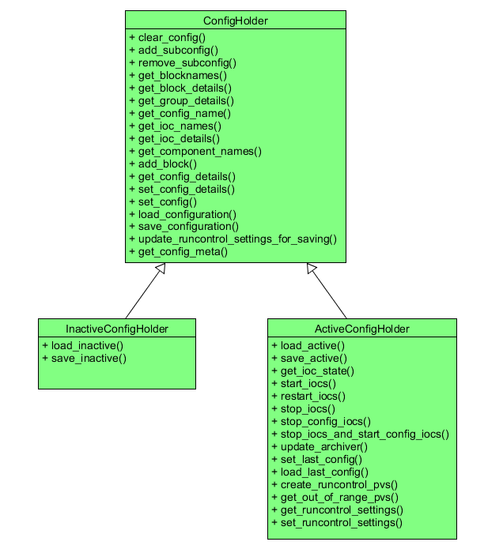

# Blockserver Structure

This document is intended to outline the internal structure of the BlockServer for reference by future developers. Please be aware that the BlockServer is a work in progress and as such this document is liable to change.

## Overview

The BlockServer's main responsibility is to look after configurations and their associated files. It can be used to read/write
to both the active configuration on the instrument and other potential configurations in the filesystem. It also contains a
filewatcher to ensure that any manual changes to configurations are correctly handled. Below is an UML overview of the most 
significant parts:


## Channel Access

The BlockServer uses the pcaspy Python module to implement channel access. There are two main means of implementing PVs in the
BlockServer, static PVs and dynamic PVs:

* Static PVs are created in a dictionary at startup and are intercepted by subclassing the Driver class and implementing the read()
  and write() methods. Most of the PVs the BlockServer uses are written like this and the method is well documented in the pcaspy 
  documentation_. Note that if you are monitoring this PV for changes, you need to call setParam() followed by updatePVs() in the blockserver to propagate this change to the monitors. You can check whether this is working properly by putting a `camonitor` on the PV in question and checking that it automatically updates when the PV value is changed.

PVs created in this manner do not have an alarm severity field `.SEVR` like they automatically do in EPICS. If such a field is necessary, for example for displaying the PV in the GUI banner, then it can be added manually. For example, to make a PV constantly have `NO_ALARM`, add the following to `initial_dbs` in `block_server.py`:
```python
BlockserverPVNames.PV_NAME_SEVR: {'type': 'enum', 'count': 1, 'value': PV_NAME_SEVR_VALUE, "enums": ["NO_ALARM"]}
```
where `PV_NAME_SEVR` is the PV address with `.SEVR` on the end, and `PV_NAME_SEVR_VALUE` is the value of the enum, 0 in this case as there is only one defined. Add
```python
elif reason == BlockserverPVNames.PV_NAME_SEVR:
    value = PV_NAME_SEVR_VALUE
```
to `read` and `self.setParam(BlockserverPVNames.PV_NAME_SEVR, PV_NAME_SEVR_VALUE)` to the appropriate monitor update method so that the alarm value is given when something (e.g. the GUI) tries to get the alarm severity.

Documentation: http://pcaspy.readthedocs.org/en/latest/

* Dynamic PVs are more complex and are required for serving PVs for each inactive configuration, the names of which are not known
  until startup. To do this we have created our own pcaspy server called CAServer that can be found in 
  inst_server\\server_common\\channel_access_server.py. This server has a number of simple methods to register new PVs within it's own 
  dictionary and pass them to channel access when requested. The server also assumes that all PVs will be in a string format, which is
  currently a good assumption. All dynamic PVs are created by the ConfigListManager as they relate to the inactive configs/components
  that are listed in that class. A simple diagram of this relationship is shown below:


   
A simple example of both the static and dynamic PVs is located in inst_server\\BlockServer\\blockserver_docs\\resources\\pcaspy_example.

## Configuration Servers

There are two Configuration Server Manager classes. The ActiveConfigHolder class holds the currently configuration and deals with the JSON communication between the BlockServer PVs and what modifications to make for the configuration. It also controls the running of the IOCs. This class is a subclass of ConfigHolder which is used to hold the basic details about the configurations as well as save/load them to disk. Most, if not all, of the individual get/set methods in the ConfigHolder are being replaced by catch-all get_config_details() and set_config_details(). A reduced description of the classes is given below:


	
## Configurations

The ConfigHolder class does most of the implementation for the specifics of editing a configuration making sure that all parts of the configuration follow the correct rules. It holds a Configuration object which does very little other than contain all the relevant configuration details. There are also small container classes to hold separate Blocks, Groups, IOCs and MetaData.

The ConfigHolder also uses the methods from the static class ConfigurationFileManager, which deal with the specifics of the file system
including version control of configuration files. This FileManager class uses a ConfigurationXmlConverter object to help convert into 
the xml used for saving and loading.

## Setting a new configuration

When the GUI sets a new configuration, whether by editing the current configuration or by loading a configuration from disk, the configuration is first saved into an inactive configuration object and then loaded into the active configuration. This means that there is only one code path for changing the current configuration.

When loading a new configuration, the blockserver will decide which iocs need to be started or restarted based on the differences in attributes of the current configuration and the new configuration. Likewise, it will only restart other services (block cache, run control, etc) if necessary.
