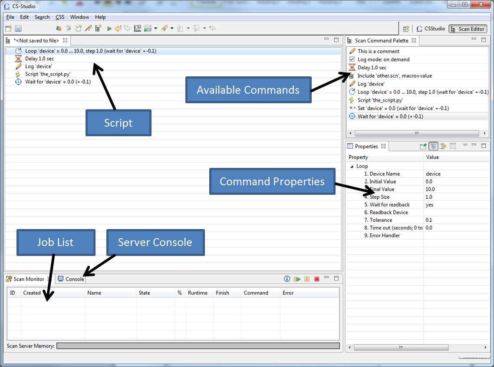
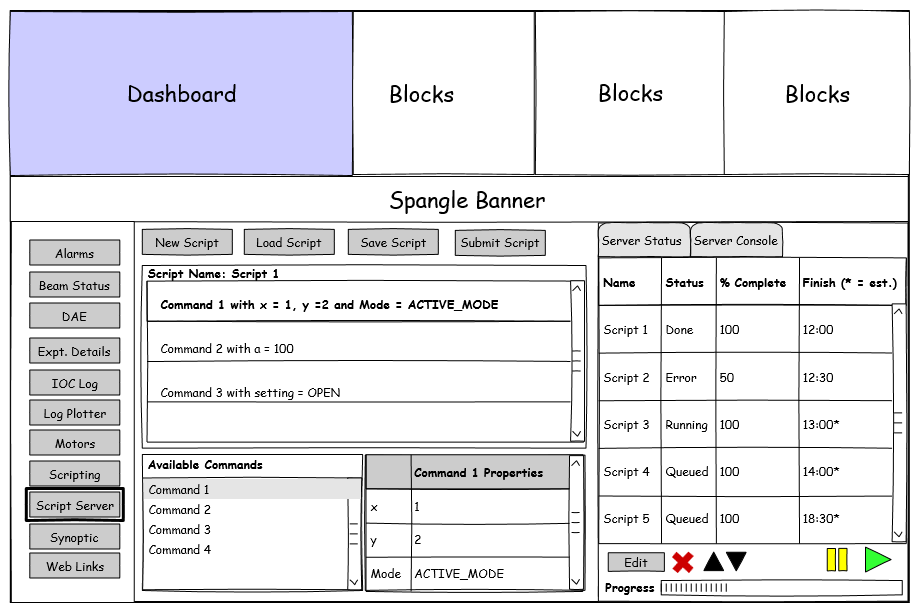
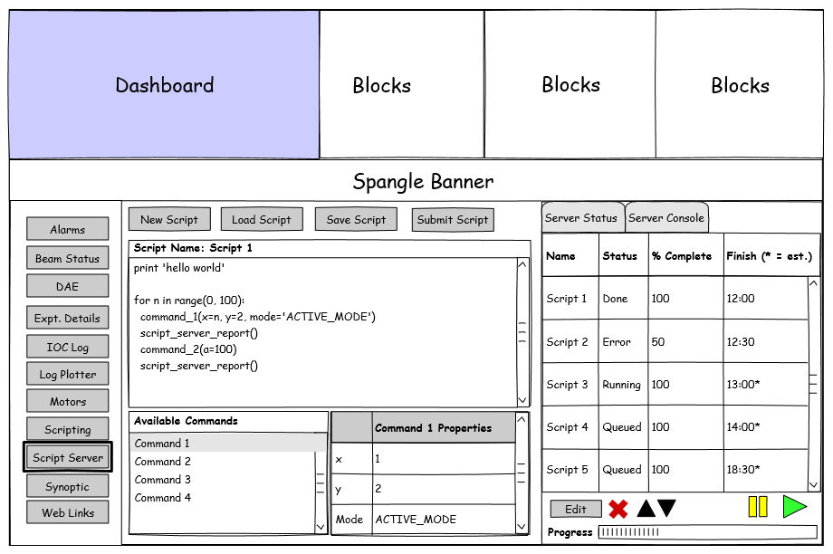

# Script server front end design document

This document is designed to be read in conjunction with the equivalent [back-end design document](Script-Server-Back-End-Design-Document).

## What it should do

* Be able to run as part of the main IBEX client
* Access the script server for the instrument that IBEX is currently pointing at
* Read the available commands for the current instrument, including the name, parameters and description.
* Allow addition of new commands* (optional)
* Allow the available commands to be used to create a new script via a drag and drop interface. The client will be responsible for converting the available commands into a Python script, and inserting the necessary server call backs.
* Allow new scripts to be created as hand-written code (i.e. plain text document)
* Allow scripts to be saved locally, before they are sent to the server
* Allow scripts to be loaded from disk
* Script builder scripts will need to be saved as XML, hand-written scripts can be saved as Python, but either can be sent to the server
* Allow the creation new jobs and send them to the server to be queued
* Show the current status of the job queue
* Show the status of the current job (% done, current line etc.)
* Edit the job queue (e.g. reordered, jobs skipped or repeated)
* Tell the server to abort or suspend the current job
* Show the details of currently queued jobs
* Edit queued jobs
* Edit the currently running job (optional)
* Show an estimate of how long a job will take from the server
* Show the elapsed time for the current job
* Script validation – can provide feedback on potential issues when creating or editing a job, and an estimate of the length of time the job will take. The main validation and time estimates should be done on the server side. Some basic validation could be done in the client (e.g. parameters have values set).
* Show if a job has finished successfully or not, and show a detailed error report from the server if a job has failed
* Be able to run separately from the main IBEX client (optional)

(*) These actions should only be allowed by instrument scientists and the controls teams

## Note on naming

We need to be careful how we name different parts. There is server that is responsible for queuing and running jobs and something responsible for building scripts and sending them to the server. Suggested names for the client are 'Script Builder', but we would prefer something to capture the fact it covers building and submitting scripts. Something more abstract such as 'Scan Engine' or 'Autorun' are other options.

## Architectural design

The script server front-end is initially planned to be part of the IBEX client, so will be an Eclipse RCP application. The architectural design should follow the design used elsewhere in the GUI, with the model-view-viewmodel pattern and a separation of the business logic in one plugin, and the UI components in another package.
The script server client should try and avoid relying on any of the other IBEX plugins. The only information the client will need is to know when the instrument has switched, so it will need to implement the InstrumentInfoReceiver interface.

## Communication with script server
The protocols for communicating with the servers that are currently used are:
* JSON over Channel Access – this is how the BlockServer serves up items such as configurations and synoptics. This generally seems to work well and instrument switching is easy to handle. This might create a large number of PVs if used for the script server. This is not as well suited to making the script server separable from the rest of IBEX.
* JMS (Java Messaging Service) – this is used by the client to communicate with the alarm server and message log server. This code is mostly from CS Studio so I do not know if we have much experience of using JMS ourselves.
* JDBC (Java Database Connection) – this is used by the archive engine and the database server for experimental details. It is probably less suitable for communication with a script server as it is not geared towards real time updating. It might be useful for archived information on scripts that have run.

REST would make a good option as it is widely used and easy to implement the Java client, as well as the Python server. It keeps it easy to use multiple clients looking at one server and to write new clients. It would be more difficult to push messages to the client with REST, so the clients may have to poll the server for information on script progress etc.

JMS can be used with a Python server by means of a broker, such as RabbitMQ or ActiveMQ. This would make supporting multiple clients fairly straightforward still, and allow messages to be pushed to clients. This would require a little more maintenance as it requires setting up the broker server. ZeroMQ is designed for high throughput but does not guarantee messages will be received. This makes it less suitable for this application. 

## Interface Design

The interface design will most likely follow a similar idea to the one from the SNS ScanServer, shown in figure 1. Figures 2 and 3 show some ideas for a mock-up following similar designs to how other parts of the IBEX client works. If the interface becomes too cluttered the script editor can be made another tab along with ‘Sever Status’ and ‘Server Console’.

*Figure 1 - SNS Scan Server*

*Figure 2: Using the script builder. New commands can be dragged and dropped into the script, and existing commands can have their properties set.*

*Figure 3: Manually editing a script – commands can still be dragged and dropped as Python commands.*