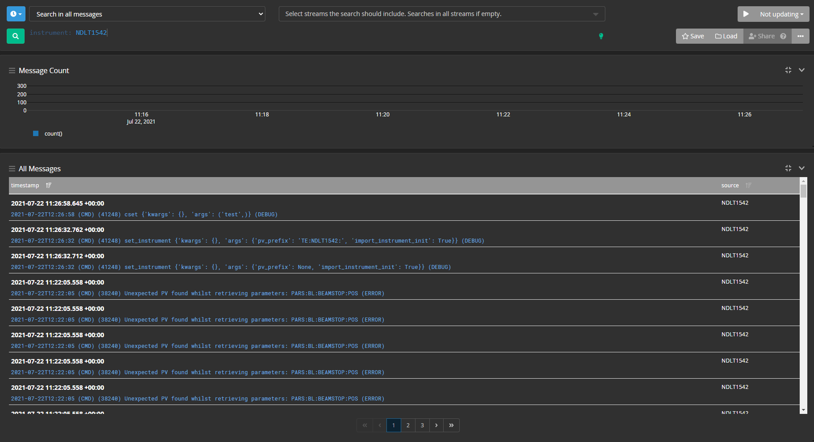

# Graylog

[Graylog](https://docs.graylog.org/) is a logging framework which has a web interface that enables users to search logs, including custom fields on logs, historically. 

The plan for using Graylog is that we dump everything into it from various sources such as the GUI, blockserver and genie_python. Currently only genie_python uses graylog. It uses the `graypy` library to do add an extra logging handler. 

## Central Graylog server 
A Graylog instance is currently running on a dedicated SCD cloud machine. This has been set up using the instructions below with a slightly modified `docker-compose.yml` file.

To access the web interface go to `<dns alias>:9000` and enter `admin` and the password for the machine. Currently we are using one input per source (genie python, ibex etc) but we could make a source per instrument in the future. 

## Setting up Graylog locally using docker

Docker and `docker compose` can be used to spin up a local graylog server with all the dependencies - to do this use [this file](https://docs.graylog.org/en/4.0/pages/installation/docker.html#persisting-data), call it `docker-compose.yml` locally and run `docker-compose up`. You can use `docker-compose down` to kill Graylog and its dependencies this way as well. 

You will need to add a Graylog `GELF UDP` input on your local instance - this can done using the web interface and can be found under `System -> Inputs`. Defaults can be left as they are, and an input name needs to be given, although the value of this doesn't matter functionally. 

To access the web interface on a local machine you _must_ use `127.0.0.1:9000` - `localhost:9000` does not seem to work (possibly because of Docker network issues) 

### Adding inputs 

Graylog requires inputs to be specified before it starts taking logs. This can be done through the web interface via System -> Inputs 

### Searching for logs

The search bar can be used to filter out logs containing certain properties, for example the function called from genie_python or the instrument it was run on. This is done like so: 

