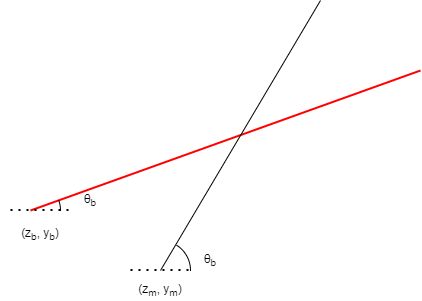

> [Wiki](Home) > [Project overview](Project-Overview) > [Design documents](Design-Documents) > [Reflectometers](Reflectometers) > [Reflectometers Beam Height Calculation](Reflectometers-Beam-Height-Calc)

In a [reflectometry instrument](Reflectometers) the height above the straight through beam can be calculated using the following diagram. It is based on the incoming angle of that beam. 


If there are two angles use the following calculation:


### Internal Calculation

IBEX reflectometry IOC performs a more general calculation for each component. The interaction is between an incoming beam at any angle and a movement axis at any angle. 



The maths for this is:

```
y - y_b = (z - z_b) tan \theta_b
y - y_m = (z - z_m) tan \theta_m
```

Where:

- z: is distance along the straight through beam
- y: is distance perpendicular to straight through beam
- theta: is the angle the axis/beam makes with the straight through beam
- _b: is subscript indicating the beam
- _m: subscript indicating the movement axis

These can be substituted and rearranged to give the intersection point at:

```
z = 1/(tan \theta_m - tan \theta_b) * (y_b - y_m + z_m * tan \theta_m - z_b * tan \theta_b)
y = tan_b * tan_m / (tan \theta_b - tan \theta_m) * (y_m / tan \theta_m - y_b / tan \theta_b + z_b - z_m)
```

There is a special case where the angles are the same and there is no intersection and then there are special cases for theta angles of 0, 180. These are all determined in the code if the angles are closer than 1e-12 to the given value. The code is https://github.com/ISISComputingGroup/EPICS-refl/blob/master/ReflectometryServer/movement_strategy.py#L31