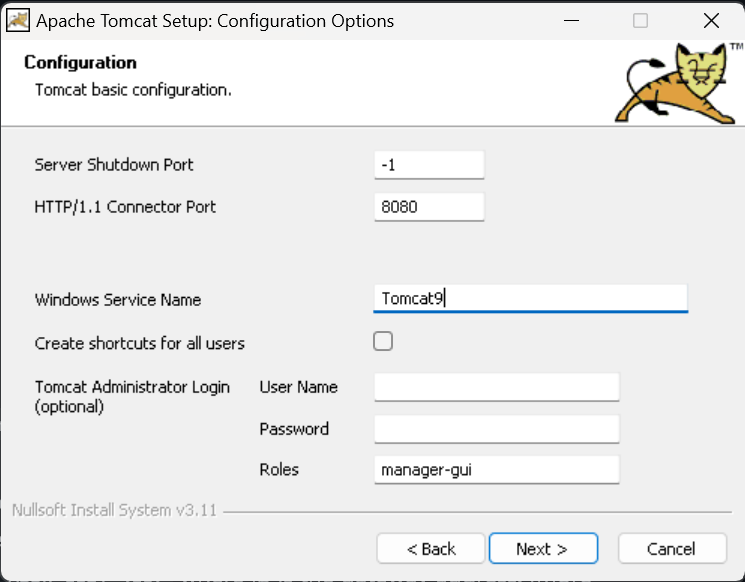
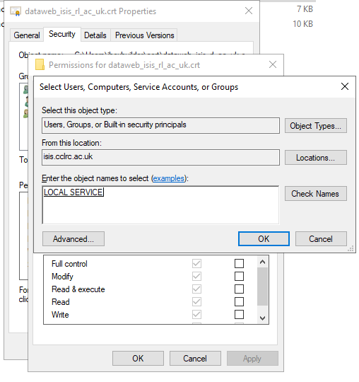

{#pvws}
# PVWS (PV Web socket)

PVWS is a tool which lets you get EPICS PV information and expose it via a websocket. We use this for the [web dashboard.](https://github.com/ISISComputingGroup/WebDashboard?tab=readme-ov-file#web-dashboard)

we run a `PVWS` instance on `NDAEXTWEB4` for the [Web Dashboard](https://github.com/ISISComputingGroup/WebDashboard)

This is done with a native tomcat service (rather than a container) following the [PVWS instructions](https://github.com/ornl-epics/pvws?tab=readme-ov-file#running-under-tomcat), though it could be run as a container in the future. 

## PVWS Config
Our config can be found [here.](https://github.com/ISISComputingGroup/pvws-config?tab=readme-ov-file#pvws-config)

## Updating
Things to consider when updating `Tomcat/PVWS`:
- Tomcat installer from https://tomcat.apache.org/download-90.cgi installed in `C:\Program Files\Apache Software Foundation\Tomcat 9.0` 
- [`pvws`](https://github.com/ornl-epics/pvws) - we are using the latest nightly .war as of 01/11/24 - to update download this and place in the tomcat `dir\webapps` folder and restart the service
- jdk 21 from https://adoptium.net/en-GB/ installed in `C:\Program Files\Eclipse Adoptium\jdk-21.0.5.11-hotspot`
- You may need to update the max message size to `131072` as per "increasing maximum message size" of https://github.com/ornl-epics/pvws?tab=readme-ov-file#running-under-tomcat - this should be done in `C:\Program Files\Apache Software Foundation\Tomcat 9.0\webapps\pvws\WEB-INF\web.xml` as per the instruction in the installation section below.

### Problem solving during updating
- Check that the file permissions on the tomcat directory are set so that `LOCAL SERIVCE` account has full access
- In the tomcat bin directory is `Tomcat9w` this will give you a config dialogue that you can use to check that the correct java path is provided
- If you create a new directory structure for tomcat, remember to copy the old config over the top

## Setting up PVWS on a machine from scratch

1) install tomcat as a windows service, using the defaults set by the wizard. Note the shutdown port to `-1`, this disables it as per [the security guidelines](https://tomcat.apache.org/tomcat-9.0-doc/security-howto.html#Server): 



During the installer expand `+Tomcat` when it asks you which components to install, and tick the option which starts tomcat on startup.

2) copy `pvws.war` to the `webapps` directory in the tomcat directory (usually `C:\Program Files\Apache Software Foundation\Tomcat 9.0\webapps`)
3) in your `tomcat\bin` directory, we need to add the `EPICS_CA` variables that specify the gateway address so PVWS knows where to look for PVs. this is done by running `Tomcat9.exe` with the `//US` (update server) flag ie: 
 `C:\Program Files\Apache Software Foundation\Tomcat 9.0\bin>Tomcat9.exe //US ++Environment EPICS_CA_AUTO_ADDR_LIST=NO;EPICS_CA_ADDR_LIST=<ip>` where ip is the gateway address. (more info on this command [here](https://tomcat.apache.org/tomcat-9.0-doc/windows-service-howto.html)) _note, don't do this in powershell as it tries to interpret the arguments as separate commands._ 
3) create a `.pfx` file if you need a new certificate by using Windows' `certificate manager -> wherever the cert is -> all tasks -> export`
  -  no, do not export the private key
  - "personal information exchange", `include all certificates in the certification path if possible: true, delete the private key if export is successful: false, export all extended properties: false, enable certificate privacy: false`

> [!NOTE]  
> when finished you'll need to add `local service` to the users that can read this file like so: 
>
> 

4) edit `server.xml` to contain these lines, removing the default connector: 

```xml
<Connector port="443" protocol="org.apache.coyote.http11.Http11NioProtocol"
               maxThreads="150" SSLEnabled="true"
               maxParameterCount="1000" Server=" " 
			   scheme="https" secure="true" clientAuth="false" sslProtocol="TLS" keystoreFile="file:///C:/PROGRA~1/APACHE~1/TOMCAT~1.0/dataweb.pfx" keystoreType="PKCS12" keystorePass="<keeper:.pfx keystore password for PVWS tomcat instance on NDAEXTWEB3>"
               >
    </Connector>
```

this will start a https connector using the `.pfx` file generated from the certificate. 

5) go to `services.msc` and hit restart on the tomcat service then navigate to `https://<machine name>:7777/pvws` - this should present the PVWS test page. 
6) update the max message size to `131072` as per "increasing maximum message size" of https://github.com/ornl-epics/pvws?tab=readme-ov-file#running-under-tomcat - this should be done in `C:\Program Files\Apache Software Foundation\Tomcat 9.0\webapps\pvws\WEB-INF\web.xml`
7) restart the service again
8) if you want the web dashboard to permanently use this, update https://github.com/ISISComputingGroup/WebDashboard/blob/main/.env
9) Add the following in `C:\Program Files\Apache Software Foundation\Tomcat 9.0\conf\web.xml` (or equivalent path if you've updated tomcat):

```
  <security-constraint>
    <web-resource-collection>
      <web-resource-name>restricted methods</web-resource-name>
      <url-pattern>/*</url-pattern>       
      <http-method>OPTIONS</http-method>
      <http-method>DELETE</http-method>
    </web-resource-collection>
    <auth-constraint/>
  </security-constraint>
```

## Renewing the certificate

1. For access to the host, see the [systems administration wiki](https://shadow.nd.rl.ac.uk/ibex_sysadmin_manual/systems/Webserver.html).
1. Request a new certificate
   1. Use OpenSSL to generate a CSR (for simplicity, do this on the host using Git Bash):
      
      `winpty openssl req -newkey rsa:2048 -keyout PRIVATEKEY.key -out MYCSR.csr`
   
      The answers to the questions it asks can be found by opening the old certificate. Store the passphrase you use to encrypt the private key somewhere safe (e.g. keeper) and the private key in a sensible directory (e.g. `C:\certificates\yyyy-mm`)
   1. Send the CSR to DI requesting a new certificate (use the group email account)
   1. wait for an email back with a link to the signed certificate 
1. Once we receive the certificate back, generate a `.pfx`/`.p12` file (for simplicity, do this on the host)
   1. On the host, open the link sent by the certificate provider (`as Certificate (w/ chain), PEM encoded`) and use it to download the certificate to a sensible directory (e.g. `C:\certificates\yyyy-mm`)
   1. Run OpenSSL in that directory using Git Bash to combine the certificate and private key:

      `winpty openssl pkcs12 -export -out new_cert_yy_mm.pfx -inkey key.key -passin pass:PASSWORD -in cert.cer`

      Where `key.key` is the private key created when you created your certificate signing request in step 2, `PASSWORD` is the passphrase used to generate that key, and `cert.cer` is the certificate you downloaded. When prompted enter the passphrase specified for the current certificate in `C:\Program Files\Apache Software Foundation\Tomcat 9.0\conf\server.xml` and also stored in keeper.

      Note: `winpty` may be required for openssl to function correctly on Windows. 
1. Add `local service` to the users that can read the file you have just generated like so:

   

1. Open `server.xml` (see above) to work out where the current `keystoreFile` is. Rename this by appending `.old` or similar to make reverting this change easier
1. rename the `.pfx` file generated to match the name of the previous key-store file and place it in the same directory. The file extension may be `.p12` rather than `.pfx`, they are interchangeable for this purpose. (If doing this using windows explorer, you may want to ensure that file extensions are visible).
1. Go to `services.msc` and restart the tomcat service (name starts `APACHE TOMCAT`).
1. In a web browser, navigate to `https://<machine name>/pvws` - this should present the PVWS test page. User you browser to check that the new certificate is in use (should have later expiry date)
1. Add a task to the group tasks list to renew the certificate with a due date one month before expiry

## Gateway

A gateway runs on NDAEXTWEB4 which is needed to only allow PVWS to access some PVs but not others. 

This runs under the task scheduler as making a `.bat` run as a Windows service is not trivial. 

the files in the top level (`gw_*` and `start_gateway.bat`) of this repo are located in `C:\gateway` on the machine it is running on. A static gateway build is also required (ie. from the latest static build of EPICS)

This points at `control-svcs` gateway, but denies everything that isn't in the gateway pvlist. It also only gives read-only access to any clients (in this case PVWS itself)


## Useful reading
https://tomcat.apache.org/tomcat-9.0-doc/windows-service-howto.html


