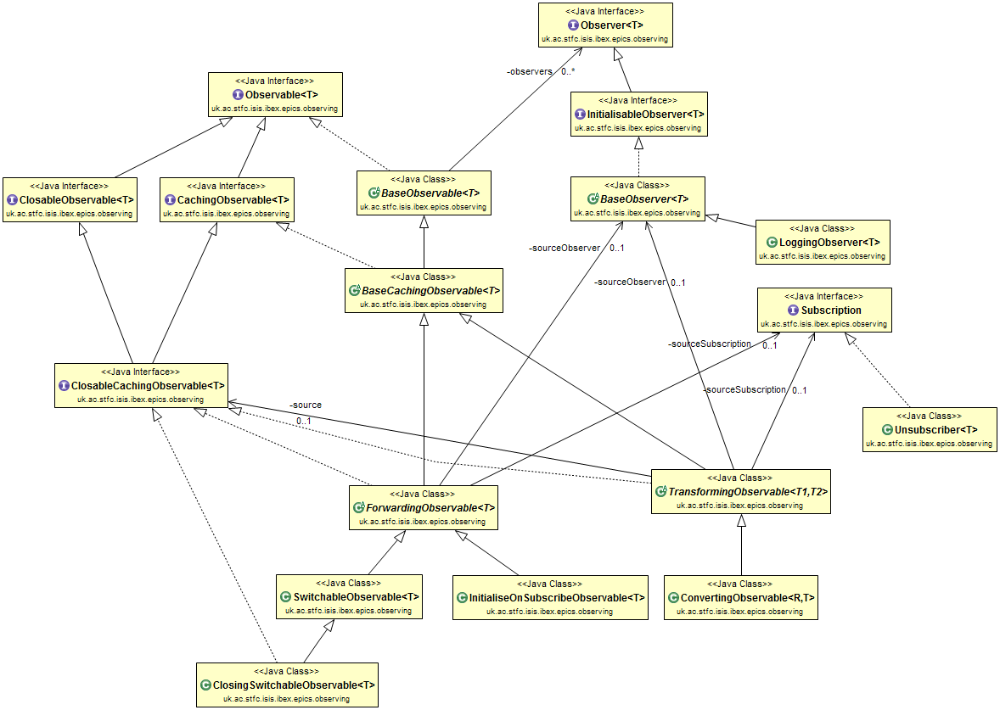
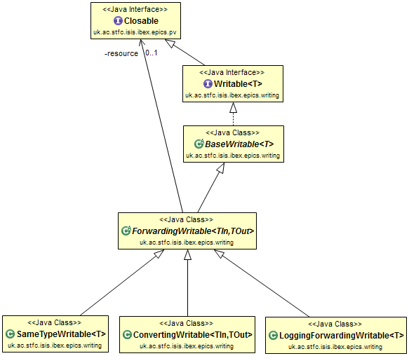
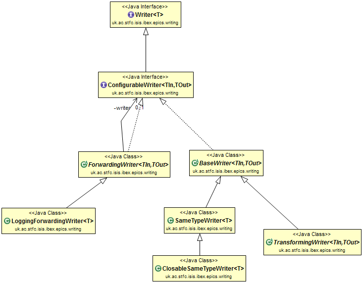

================================================================
Class Diagrams for Observables, Observers, Writables and Writers
================================================================

This document contains the class diagrams for the various classes that relate to reading and writing to PVs.
It also shows how the design has been evolved and refactored over time.

Observables and Observers Overall Diagram
=========================================

NOTE: PairObservable is not depicted for clarity.

Original
--------

    
November 2015
-------------

.. image:: images/refactoring_for_observables_and_writers/observables_and_observers_nov_2015.png
    :scale: 100 %
    :align: center

Observables
===========
Original
--------

.. image:: images/refactoring_for_observables_and_writers/observables_before.png
   :height: 606 
   :width: 449
   :scale: 100 %
   :align: center

November 2015
-------------

.. image:: images/refactoring_for_observables_and_writers/observables_after.png
   :height: 525 
   :width: 438
   :scale: 100 %
   :align: center

Observers
=========
Original
--------

.. image:: images/refactoring_for_observables_and_writers/observers_before.png
   :height: 606 
   :width: 449
   :scale: 100 %
   :align: center

November 2015
-------------

.. image:: images/refactoring_for_observables_and_writers/observers_after.png
   :height: 525 
   :width: 438
   :scale: 100 %
   :align: center

After refactoring the two existing interfaces were combined into a single Observer interface, and ObservableAdapter was renamed.

Writables
=========
Original
--------

.. image:: images/refactoring_for_observables_and_writers/writables_before.png
   :height: 606 
   :width: 449
   :scale: 100 %
   :align: center

November 2015
-------------

Writers
=======
Original
--------

.. image:: images/refactoring_for_observables_and_writers/writers_before.png
   :height: 606 
   :width: 449
   :scale: 100 %
   :align: center

November 2015
-------------

