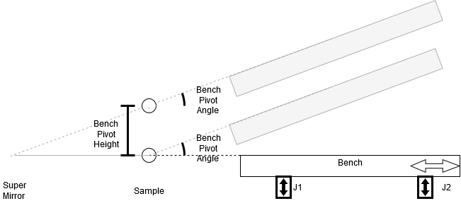

> [Wiki](Home) > [The Backend System](The-Backend-System) > [Specific Device IOC](Specific-Device-IOC) > [Miscellaneous motion control](Miscellaneous-Motion-Control) > [Reflectometry IOC](Reflectometry-IOC) > [Reflectometry Configuration](Reflectometry-Configuration) > [Reflectometry Bench Configuration](reflectometry-bench-configuration)

The bench and theta interactions are particularly difficult to set up this page should explain that setup. The bench is as follows:



The configuration is:

```
    # Theta 
    # -----
    # (This is the component which specifies and reads theta, not the bench angle but coupled to it)
    z_sample = 584
    # theta component
    theta_comp = add_component(ThetaComponent("ThetaComp", PositionAndAngle(0.0, z_sample, 90)))
    # parameters allowing it to be set and read.
    theta_param_angle = add_parameter(AxisParameter("THETA", theta_comp, ChangeAxis.ANGLE, autosave=False), modes=[nr])

    # Bench
    # -----

    # constants
    z_bench_pivot = z_sample  # position the bench pivots around in this case the sample
    z_bench_front = z_bench_pivot + 1201  # front of bench (in this case it is 1201 away from the sample)
    z_bench_pivot_to_front_jack = 1201   # jack is also at the front of the bench
    z_bench_pivot_to_rear_jack = z_bench_pivot_to_front_jack + 1558.0  # rear jack is spaced 1558 from front jack
    angle_of_bench = 2.3  # the angle of the bench so when it is alligned with a optical level this is included
    bench_pivot_to_beam = 628  # distance from the bench surface to the beam above the bench

    # bench component
    bench = add_component(BenchComponent("bench", BenchSetup(0.0, z_sample, 90,
                                                            z_bench_pivot_to_front_jack, z_bench_pivot_to_rear_jack,
                                                            angle_of_bench, bench_pivot_to_beam)))

    # parameters to set angle, offset, seesaw and chi of bench
    add_parameter(AxisParameter("BENCH_ANGLE", bench, ChangeAxis.ANGLE, autosave=True), modes=all_modes)
    add_parameter(AxisParameter("BENCH_OFFSET", bench, ChangeAxis.POSITION), modes=all_modes)
    add_parameter(AxisParameter("BENCH_SEESAW", bench, ChangeAxis.SEESAW, autosave=True), modes=all_modes)
    add_parameter(AxisParameter("BENCH_CHI", bench, ChangeAxis.CHI), modes=all_modes)

    # Drivers to move the bench jacks, horizontal slide and shi
    add_driver(IocDriver(bench, ChangeAxis.JACK_FRONT, MotorPVWrapper("MOT:MTR0801")))
    add_driver(IocDriver(bench, ChangeAxis.JACK_REAR, MotorPVWrapper("MOT:MTR0802")))
    add_driver(IocDriver(bench, ChangeAxis.SLIDE, MotorPVWrapper("MOT:MTR0803")))
    add_driver(IocDriver(bench, ChangeAxis.CHI, MotorPVWrapper("MOT:MTR0804")))

    # finally point theta at the bench angle
    theta_comp.add_angle_of(bench)

```

Items to note:

1. Bench position in z is the place we want to pivot about not the front of the bench. So for a bench following the sample this is the sample point
1. The bench angle is the angle is makes with the incoming beam this is usually zero
1. The seesaw parameter MUST be autosaved; this is because seesaw and angle are both defined by the relative jack positions
1. The bench offset is the vertical offset of the bench.
1. The line of the config points theta at the bench so either theta or the the angle must be autosaved so that the other can be calculated
