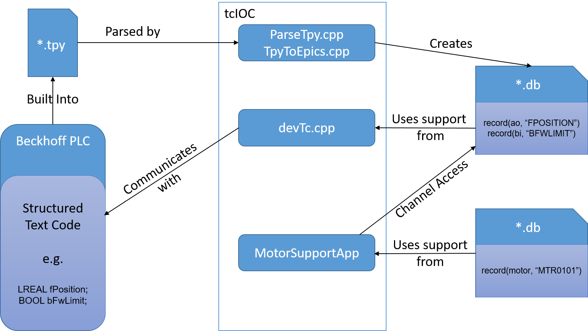

> [Wiki](Home) > [The Backend System](The-Backend-System) > [IOCs](IOCs) > [Motor IOCs](Motor-IOCs) > [Beckhoff](Beckhoff) > [tcIOC](tcIOC)

**Note: we no longer use tcIOC for numerous reasons, the most important being the dependence on the unreliable `.tpy` file format which was preventing us from integrating the new motion standard library code. We now use `AdsDriver` in conjunction with `TwincatMotor`.**
# General information

This IOC was originally written at LIGO and is in a stable state. The original version from tcIOC was targeted at the use of Beckhoffs as generic PLCs and had no specific motion support. It constructs db records by examining the built PLC project files and communicates with it using ADS (Beckhoff's own protocol). More detail can be found at https://github.com/ISISComputingGroup/EPICS-tcIoc.

## Making PLC variables visible

tcIOC uses OPC tags to know which PLC variables to expose as PVs. These OPC tags must be specified in the structured text code as comments, the format of which is specified in the [Beckhoff documentation](https://infosys.beckhoff.com/english.php?content=../content/1033/tcopcuaserver/117093590390367755.html&id=) (note that tcIOC uses the `*.tpy` Twincat 2 style). Twincat XAE is very particular about the format of these comments, they must be immediately after the variable and not preceded by any other comments. If you are not sure if they have been added correctly open the built `*.tpy` file and search for `<Name>OPC</Name>`, which should be next to your variable in the XML structure. As mentioned in the linked documentation specifying a variable as visible in OPC is recursive e.g. if you set something with a complex type as visible all the variables that make up this type will also be visible unless explicitly set to not be in the structure definition. Additionally there are other [OPC properties](https://infosys.beckhoff.com/english.php?content=../content/1033/tf6120_tc3_opcda/80189195.html&id=) that you can set in the structured text. The only one of these we currently use is `OPC_PROP[0005]` to control if something is read/write. Further testing is needed to see which other of these properties could be useful.

# Motion Support

We added motor support to tcIOC so that we could use it to control motors in the usual way. As a first prototype implementation the motor support is a Model 3 motor driver that has the structured text variables of interest hardcoded into the driver. tcIOC will convert these to PVs and the driver will talk to them over channel access. This was chosen as the basic implementation that would be quickest to implement and works well, however there are a number of improvements that could be made:

* If tcIOC was converted to an `asyn` driver then the motor could talk to this asyn port rather than communicate across CA
* If the interesting variables in the PLC code change name so must the IOC, we could get around this by tagging in the comments of the PLC code with which variables are the interesting ones
* The number of axes is hardcoded within the IOC this can be solved by tcIOC creating the required number of motor records when it parses the `.tpy` file

# Releasing the IOC

Currently the IOC is not in the normal EPICS release build as it requires VS 2010. To deploy it to an instrument you will need to copy from `build_area_on_share\EPICS\newbuildtest\*\EPICS\support\tcIoc\master` and `build_area_on_share\EPICS\newbuildtest\*\EPICS\ioc\master\TWINCAT`. If you're deploying this on CRISP you can test it by running the TWINCAT IOC with appropriate settings (see globals.txt) then confirming that `MOT:MTR0701.RBV` has a realistic value. 

# Troubleshooting

## The IOC reads from the PLC but does not reliably write
Reduce the scan rate of the IOC, the `tcSetScanRate` command in the IOC is responsible for setting this. It appears that if there are many variables to read the driver will spend all it's time reading and will not get round to writing, it does not produce an error when this happens.